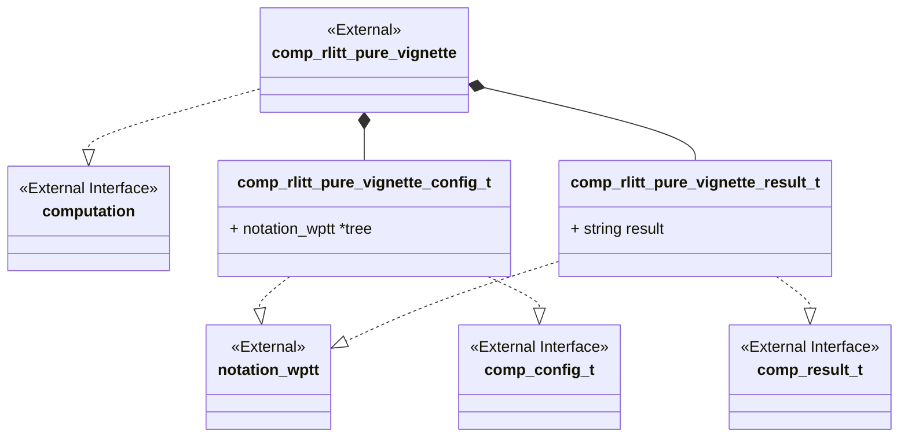
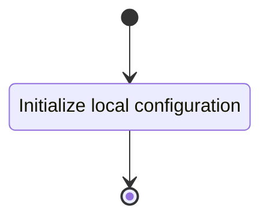
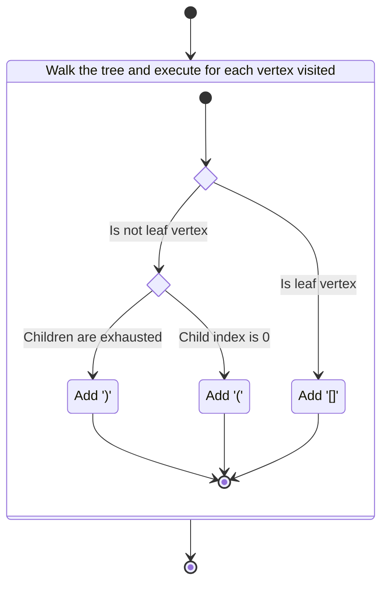

# Unit Description

## Class Diagram



## Language

C

## Implements

- [Computation Interface](#computation-interface)

## Uses

- [Notation Weighted Planar Tangle Tree](#note-wptt)

## Libraries

None

## Functionality

### Public Structures

#### Configuration Structure

The configuration structure contains the data needed for computing the pure vignette of an input
RLITT.

This includes:

- A pointer to a read-only notation structure for an RLITT.

#### Result Structure

The result structure contains the linearized string representation of the pure vignette of the input
RLITT.

### Public Functions

#### Configuration Function

The configuration function sets the local configuration variable of the computation.

This process is described in the following state machines:



#### Compute Function

The compute function carries out the arborescent tangle pure vignette computation. The function may
contain sub-machines that can be broken out into functions in the implementation. The walk the tree
function should be implemented with a stack-based iterative approach.

This process is described in the following state machines:



#### Result Function

When this function is invoked, the result of the pure vignette computation process is reported.

## Validation

### Configuration Function

#### Positive Tests

```{test-card} Valid Configuration

A valid configuration for the computation is passed to the function.

**Inputs:**

- A valid configuration.

**Expected Output:**

A positive response.

```

#### Negative Tests

```{test-card} Null Configuration

A null configuration for the computation is passed to the function.

**Inputs:**

- A null configuration.

**Expected Output:**

A negative response.

```

```{test-card} Null configuration Parameters

A configuration with various null parameters is passed to the function.

**Inputs:**

- A configuration with null tree.

**Expected Output:**

A negative response.

```

### Compute Function

#### Positive Tests

```{test-card} A valid configuration

A valid configuration is set for the component. The computation is executed and
returns successfully. The result written to the write interface is correct.

**Inputs:**

- A valid configuration is set with $\iota [3 3 3 3]$ configured.

**Expected Output:**

- A positive response.
- A correct output on the write interface.

```

```{test-card} Correct handling of tangles

A valid configuration is set for the component. The computation is executed and
returns successfully. The result written to the write interface is correct.

**Inputs:**

- A valid configuration is set, the following trees are configured:
    - i((([3][3])-3)3)
    - i([3][3]3)
    - i[3 3 3 3]
    - i(([3][3]3)([3][3]3)([3][3]3))
    - i[3]

**Expected Output:**

- A positive response.
- A correct output on the write interface:
    - i((([][])))
    - i([][])
    - i((([])))
    - i(([][])([][])([][]))
    - i[]
```

#### Negative Tests

```{test-card} Not Configured

The compute interface is called before configuration.

**Inputs:**

- None.

**Expected Output:**

A negative response.

```

### Result Function

#### Positive Tests

```{test-card} A valid configuration and computation

A valid configuration is set for the component. The computation is executed and
returns successfully. The resulting value is correct when read from the result
interface.

**Inputs:**

- A valid configuration is set, the following trees are configured:
    - i((([3][3])-3)3)
    - i([3][3]3)
    - i[3 3 3 3]
    - i(([3][3]3)([3][3]3)([3][3]3))
    - i[3]

**Expected Output:**

- A positive response.
- The result is correct:
    - i((([][])))
    - i([][])
    - i((([])))
    - i(([][])([][])([][]))
    - i[]
```

#### Negative Tests

```{test-card} Computation not executed

The result interface is called before compute has been run.

**Inputs:**

- None.

**Expected Output:**

A negative response.

```

## Doxygen Documentation

```{doxygenfile} comp_rlitt_pure_vignette.h

```

```{doxygenfile} comp_rlitt_pure_vignette.c

```

## Bibliography

```{bibliography}
   :filter: docname in docnames
```

```{raw} latex
    \newpage
```
