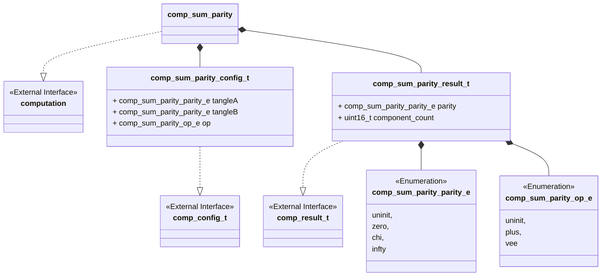
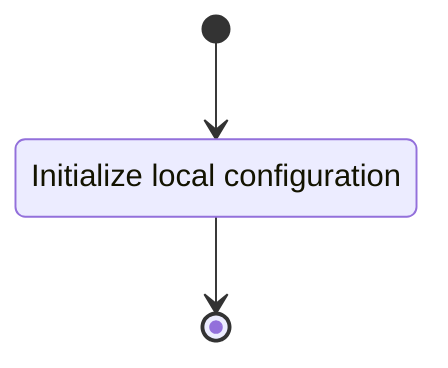
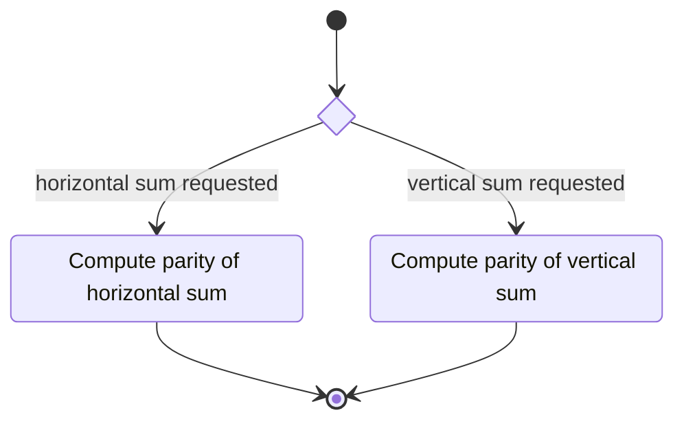

# Unit Description

## Class Diagram

## Language

C

## Implements

- [Computation Interface][interface-computation]

## Uses

None

## Libraries

None

## Functionality

### Public Structures

#### Configuration Structure

The configuration structure contains the data needed for computing the parity of the horizontal or
vertical sum of two tangles.

This includes:

- Two sumand tangles A and B
- An operation to apply

#### Result Structure

The result structure contains the parity of the tangle that results from the sum and a count of
knotted components.

### Public Functions

#### Configuration Function

The configuration function sets the local configuration variable of the computation.

This process is described in the following state machines:

#### Compute Function

The compute function carries out the computation as described in the use-case. The function may
contain submachines that can be broken out into functions in the implementation. The walk the tree
function should be implemented with a stack-based iterative approach.

This process is described in the following state machines:

#### Result Function

When this function is invoked, the result of the vertex parity computation process is reported.

## Validation

### Configuration Function

#### Positive Tests

> [!test-card] "Valid Configuration"
>
> A valid configuration for the computation is passed to the function.
>
> **Inputs:**
>
>   - A valid configuration.
>
> **Expected Output:**
>
>    A positive response.

#### Negative Tests

> [!test-card] "Null Configuration"
>
> A null configuration for the computation is passed to the function.
>
> **Inputs:**
>
>   - A null configuration.
>
> **Expected Output:**
>
>    A negative response.

> [!test-card] "Null Configuration Parameters"
>
> A configuration with null parameters is passed to the function.
>
> **Inputs:**
>
>   - A configuration with null WPTT.
>
> **Expected Output:**
>
>    A negative response.

### Compute Function

#### Positive Tests

> [!test-card] "A valid configuration with null write interface"
>
> A valid configuration is set for the component with null write. The computation is executed and
> returns successfully.
>
> **Inputs:**
>
>   - A valid configuration is set.
>
> **Expected Output:**
>
>   - A positive response.

> [!test-card] "Identified vertex is canonical"
>
> A valid configuration with write function is set for the component. The computation executes and
> returns successfully.
>
> **Inputs:**
>
>   - Set a valid configuration for all possible combinations of parities.
>
> **Expected Output:**
>
>   - A positive response.

#### Negative Tests

> [!test-card] "Not Configured"
>
> The compute interface is called before configuration.
>
> **Inputs:**
>
>   - None.
>
> **Expected Output:**
>
>    A negative response.

### Result Function

#### Positive Tests

> [!test-card] "A valid configuration and computation"
>
> A valid configuration is set for the component. The computation is executed and returns
> successfully. The resulting values are correct when read from the result interface.
>
> **Inputs:**
>
>   - Set a valid configuration for all possible combinations of parities.
>
> **Expected Output:**
>
>   - A positive response.

#### Negative Tests

> [!test-card] "Computation not executed"
>
> The result interface is called before compute has been run.
>
> **Inputs:**
>
>   - None.
>
> **Expected Output:**
>
>    A negative response.
