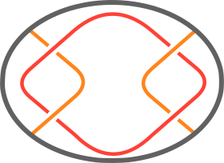

## Mathematical Description

Every two string tangle comes equipped with four fixed points labeled NW, NE, SW, and SE. In every
tangle these fixed points are connected to each other in pairs by two strings. We classify these
connections by those present in the four basic tangles ($0$, $1$, $-1$, and $\infty$). The full
table of connectivity can be seen be low.

| x   | NW                                    | NE                                    | SW                                    | SE                                    |
| --- | ------------------------------------- | ------------------------------------- | ------------------------------------- | ------------------------------------- |
| NW  | x                                     | { width="40" }  | { width="40" } | { width="40" }     |
| NE  | { width="40" }  | x                                     | { width="40" }     | { width="40" } |
| SW  | { width="40" } | { width="40" }     | x                                     | { width="40" }  |
| SE  | { width="40" }     | { width="40" } | { width="40" }  | x                                     |

Notice that the $\pm 1$ tangles have the same connectivity we label this as $\chi$. We call the
connectivity class of a tangle its **parity**.

Now, we examine parity under the $+$ and $\vee$ operations.
We enumerate the parity under the operations as follows:

| $+$      | $0$      | $\chi$   | $\infty$ |
| -------- | -------- | -------- | -------- |
| $0$      | $0$      | $\chi$   | $\infty$ |
| $\chi$   | $\chi$   | $0$      | $\infty$ |
| $\infty$ | $\infty$ | $\infty$ | $\infty$ |

| $\vee$   | $0$ | $\chi$   | $\infty$ |
| -------- | --- | -------- | -------- |
| $0$      | $0$ | $0$      | $0$      |
| $\chi$   | $0$ | $\infty$ | $\chi$   |
| $\infty$ | $0$ | $\chi$   | $\infty$ |

An interesting consequence of the $\infty+\infty$ and $0\vee0$ cases is the introduction off of a
knotted component of the tangle.

<!-- rumdl-disable -->
> [!Example]
>
> Consider the algebraic tangle expression $\frac{1}{2}+\frac{1}{2}$ which resolves as
>
> {width="500"}
>
> /// caption
>
> Result of $\frac{1}{2}+\frac{1}{2}$.
>
>///
>
> We see in red the knotted component introduced by the operation.
>
> {width="500"}
>
> /// caption
>
> Components of the resultant tangle.
>
>///
<!-- rumdl-enable -->

Taking parity with a count of components is invariant for the tangle.

## Computational Description

No special computational considerations.
