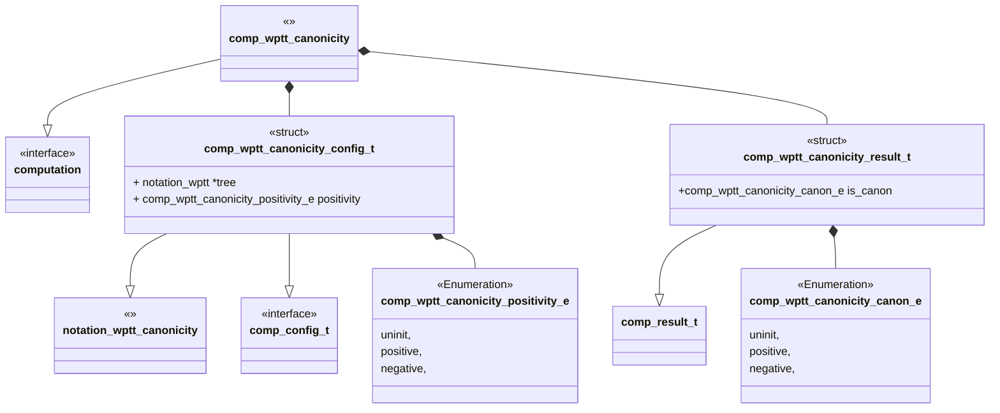
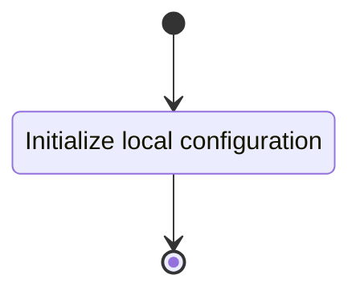
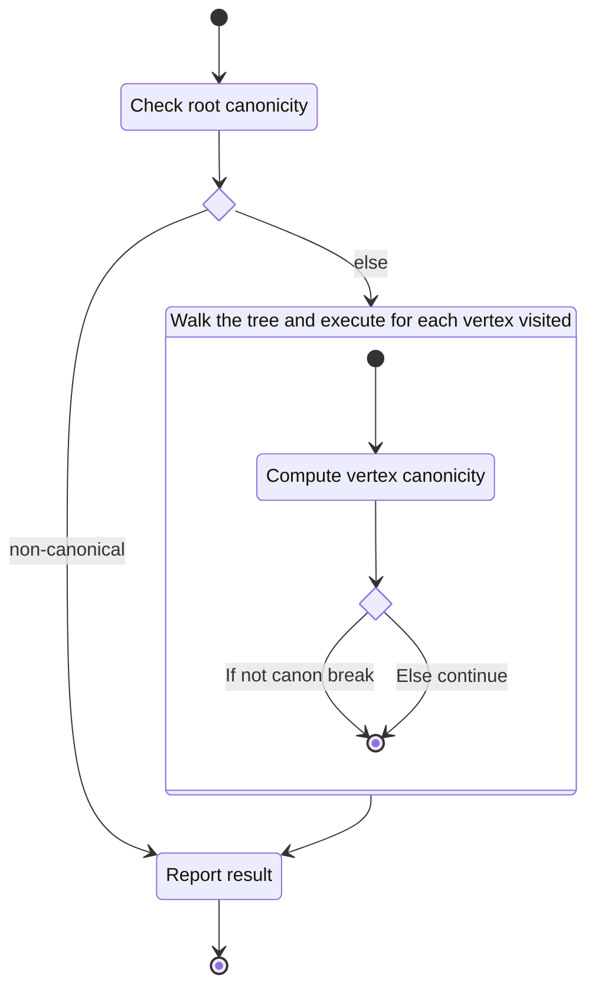
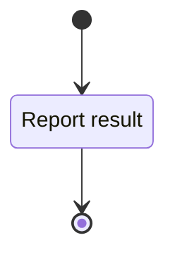

# Unit Description



## Language

C

## Implements

- [Computation Interface][interface-computation]

## Uses

- [Notation Weighted Planar Tangle Tree][note-wptt]
- [Computation WPTT Vertex Canonicity][comp-wptt_vertex_canonicity]

## External Libraries

None

## Functionality

### Public

#### Structures

##### Configuration Structure

The configuration structure has two pieces of data as follows:

- A notation for an object tree to compute canonicity of.
- Positivity to compute against, one of positive or negative.

##### Result Structure

The result structure contains only a boolean indicating canonicity.

#### Functions

##### Configuration Function

The configuration function sets the local configuration variable of the computation.

This process is described in the following state machines:



##### Computation Function

The computation function walks the object tree and computes each vertex canonicity. If each vertex
is canonical then the whole tree is canonical.



##### Result Function

When this function is invoked, the result of the canonicity computation process is reported.



### Private

#### Function

##### Walk the Tree

The tree walking function follows the pattern used by other WPTT components.

## Validation

### Configuration Function

#### Positive Tests

<!-- prettier-ignore-start -->

!!! test-card "Valid Configuration"

    A valid configuration for the computation is passed to the function.

    **Inputs:**

    - A valid configuration.

    **Expected Output:**

    A positive response.

<!-- prettier-ignore-end -->

#### Negative Tests

<!-- prettier-ignore-start -->

!!! test-card "Null Configuration"

    A null configuration for the computation is passed to the function.

    **Inputs:**

    - A null configuration.

    **Expected Output:**

    A negative response.

<!-- prettier-ignore-end -->

<!-- prettier-ignore-start -->

!!! test-card "Null configuration Parameters"

    A configuration with various null parameters is passed to the function.

    **Inputs:**

    - A configuration with null tree.

    **Expected Output:**

    A negative response.

<!-- prettier-ignore-end -->

### Compute Function

#### Positive Tests

<!-- prettier-ignore-start -->

!!! test-card "A valid configuration"

    A valid configuration is set for the component. The computation is executed and
    returns successfully. The result written to the write interface is correct.

    **Inputs:**

    - A valid configuration is set with the following trees:
        - Canonical trees
            - `i[3 3]`
            - `i[3 0]`
            - `x([3 3]3[3 3])`
            - `i((([3 3]3[3 3])3)-3)`
            - `i[-3]`
            - `i[0]`
            - `i[0 0]`
            - `i[2]`
            - `i[-2]`
            - `i[1]`
            - `i[-1]`
        - Non-canonical trees
            - S.A
                - `i[3 -3]`
                - `i((([3 -3]3[3 3])3)-3)`
                - `i((([3 3]3[3 3])3)3)`
                - `i(([3 3]3[3 3])3((([3 3]3[3 3])3)3))`
            - S.0
                - `i[-1 -3]`
                - `i[1 3]`
                - `i([3 3][3 3](([3 3]3[3 3])1))`
                - `i([3 3][3 3](([3 3]3[3 3])-1))`
                - `i([3 3][3 3][1])`
                - `i([3 3][3 3][-1])`
                - `i(((([3 3]3[3 3])1)-3)[3 3])`
                - `i(((([3 3]3[3 3])-1)3)[3 3])`
                - `i(((([3 3]3[3 3])3)-1)[3 3])`
                - `i(((([3 3]3[3 3])-3)1)[3 3])`
            - S.1
                - `i[-3 0 3]`
                - `i([3 3][3 3][0])`
                - `i((([3 3]3[3 3]))[3 3])`
                - `i(((([3 3]3[3 3])3))3)`
                - `i(((([3 3]3[3 3]))3)3)`
            - W
                - `i(3[-3]3)`
                - `i([-3](3[-3]3))`
                - `i(3[-3]3[-3])`
            - P.P
                - `i([-2][3])`
                - `i([3 3](([3 3]3[3 3])-2))`
            - P.N
                - `i([2][3])`
                - `i([3 3](([3 3]3[3 3])2))`

    **Expected Output:**

    - A positive response.
    - A correct output on the write interface.

<!-- prettier-ignore-end -->

<!-- prettier-ignore-start -->

!!! test-card "A valid configuration with null write interface"

    A valid configuration is set for the component with null write. The computation is
    executed and returns successfully.

    **Inputs:**

    - A valid configuration is set.

    **Expected Output:**

    - A positive response.

<!-- prettier-ignore-end -->

#### Negative Tests

<!-- prettier-ignore-start -->

!!! test-card "Not Configured"

    The compute interface is called before configuration.

    **Inputs:**

    - None.

    **Expected Output:**

    A negative response.

<!-- prettier-ignore-end -->

### Result Function

#### Positive Tests

<!-- prettier-ignore-start -->

!!! test-card "Correct handling of a canonical tree"

    A valid configuration is set for the component. The computation is executed and
    returns successfully. The result written to the write interface is correct.

    **Inputs:**

    - A valid configuration is set, the following trees are configured:
        - One tree for each canonicity condition.

    **Expected Output:**

    - A positive response.
    - A correct output on the write interface.

<!-- prettier-ignore-end -->

<!-- prettier-ignore-start -->

!!! test-card "Correct handling of a noncanonical tree"

    A valid configuration is set for the component. The computation is executed and
    returns successfully. The result written to the write interface is correct.

    **Inputs:**

    - A valid configuration is set, the following trees are configured:
        - One tree for each canonicity condition.

    **Expected Output:**

    - A positive response.
    - A correct output on the write interface.

<!-- prettier-ignore-end -->

#### Negative Tests

<!-- prettier-ignore-start -->

!!! test-card "Computation not executed"

    The result interface is called before compute has been run.

    **Inputs:**

    - None.

    **Expected Output:**

    A negative response.

<!-- prettier-ignore-end -->

## Doxygen Documentation

```{doxygenfile} comp_wptt_canonicity.h

```

```{doxygenfile} comp_wptt_canonicity.c

```
