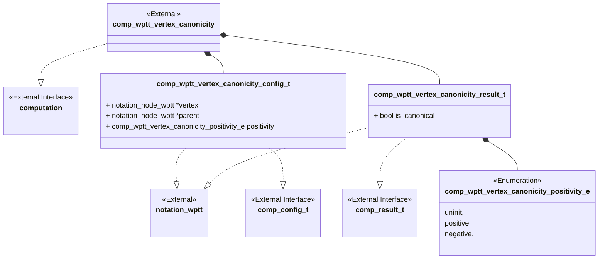
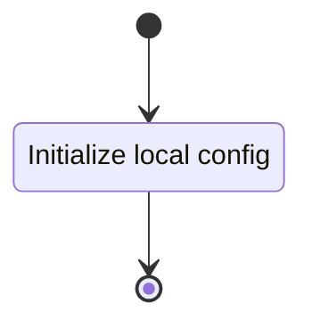
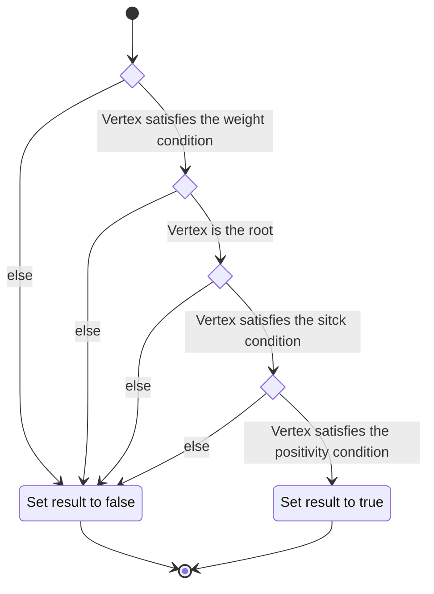

# Unit Description

## Class Diagram



## Language

C

## Implements

- [Computation Interface](#computation-interface)

## Uses

- [Notation Weighted Planar Tangle Tree](#note-wptt)

## Libraries

None

## Functionality

### Public Structures

#### Configuration Structure

The configuration structure contains the data needed for computing the canonicity of a vertex of an
input arborescent tangle.

This includes:

- A pointer to the tree containing the vertex. This is used only for output to the write interface.
- A pointer to the vertex to examine.
- A pointer to the parent of the vertex being examined.
- The positivity condition to check.

#### Result Structure

The result structure contains the enumerated value of the neutrality of the input tree.

### Public Functions

#### Configuration Function

The configuration function sets the local configuration variable of the computation.

This process is described in the following state machines:



#### Compute Function

The compute function carries out the arborescent tangle vertex canonicity computation. The function
may contain sub-machines that can be broken out into functions in the implementation. The walk the
tree function should be implemented with a stack-based iterative approach.

This process is described in the following state machines:



#### Result Function

When this function is invoked, the result of the vertex canonicity computation process is reported.

## Validation

### Configuration Function

#### Positive Tests

```{test-card} Valid Config

A valid configuration for the computation is passed to the function.

**Inputs:**

- A valid config.

**Expected Output:**

A positive response.

```

#### Negative Tests

```{test-card} Null Config

A null configuration for the computation is passed to the function.

**Inputs:**

- A null config.

**Expected Output:**

A negative response.

```

```{test-card} Null Configuration Parameters

A configuration with various null parameters is passed to the function.

**Inputs:**

- A configuration with null tree.

**Expected Output:**

A negative response.

```

### Compute Function

#### Positive Tests

```{test-card} A valid configuration with null write interface

A valid configuration is set for the component with null write. The computation is
executed and returns successfully.

**Inputs:**

- A valid configuration is set.

**Expected Output:**

- A positive response.

```

```{test-card} Identified vertex is canonical

A valid configuration with write function is set for the component. The indentified vertex is canonical. The computation is executed and returns successfully.

**Inputs:**

- A valid configuration is set.
- The indentified vertex is canonical:
    - Is the root
    - Is away from root
- The positivity is set to:
    - positive
    - negative


**Expected Output:**

- A positive response.
- True written to buffer

```

```{test-card} Identified vertex violates the alternating stick condition

A valid configuration with write function is set for the component. The indentified vertex fails to be
canonical by violating the alternating portion of the stick condition. The computation is executed
and returns successfully.

**Inputs:**

- A valid configuration is set.
- The indentified vertex is not canonical by violating:
    - vertex is $v_0$ and $w_0<0$ with $w_1<0$
    - vertex is $v_0$ and $w_0>0$ with $w_1>0$
    - vertex is $v_i$ with $i\neq 0$ and $w_{i}>0$ with $w_{i+1}>0$
    - vertex is $v_i$ with $i\neq 0$ and $w_{i}<0$ with $w_{i+1}<0$

**Expected Output:**

- A positive response.
- False written to buffer.

```

```{test-card} Identified vertex is not canonical

A valid configuration with write function is set for the component. The indentified vertex fails to be canonical in each of the conditions. The computation is executed and returns successfully.

**Inputs:**

- A valid configuration is set.
- The indentified vertex is not canonical by violating:
    - Stick condition and vertex is distance 2 from root
    - Stick condition and vertex is distance 1 from root
    - Weight condition and vertex is the root
    - Weight condition and vertex is not the root
    - Positivity condition

**Expected Output:**

- A positive response.
- False written to buffer.

```

```{test-card} Identified vertex is not canonical

A valid configuration with write function is set for the component. The indentified vertex fails to be canonical in each of the conditions. The computation is executed and returns successfully.

**Inputs:**

- A valid configuration is set.
- The indentified vertex is not canonical by violating:
    - Stick condition and vertex is distance 2 from root
    - Stick condition and vertex is distance 1 from root
    - Weight condition and vertex is the root
    - Weight condition and vertex is not the root
    - Positivity condition

**Expected Output:**

- A positive response.
- False written to buffer.

```

```{test-card} Identified vertex is not canonical

A valid configuration with write function is set for the component. The indentified vertex fails to be canonical in each of the conditions. The computation is executed and returns successfully.

**Inputs:**

- A valid configuration is set.
- The indentified vertex is not canonical by violating:
    - Stick condition and vertex is distance 2 from root
    - Stick condition and vertex is distance 1 from root
    - Weight condition and vertex is the root
    - Weight condition and vertex is not the root
    - Positivity condition

**Expected Output:**

- A positive response.
- False written to buffer.

```

```{test-card} Identified vertex is not canonical

A valid configuration with write function is set for the component. The indentified vertex fails to be canonical in each of the conditions. The computation is executed and returns successfully.

**Inputs:**

- A valid configuration is set.
- The indentified vertex is not canonical by violating:
    - Stick condition and vertex is distance 2 from root
    - Stick condition and vertex is distance 1 from root
    - Weight condition and vertex is the root
    - Weight condition and vertex is not the root
    - Positivity condition

**Expected Output:**

- A positive response.
- False written to buffer.

```

```{test-card} Identified vertex is not canonical

A valid configuration with write function is set for the component. The indentified vertex fails to be canonical in each of the conditions. The computation is executed and returns successfully.

**Inputs:**

- A valid configuration is set.
- The indentified vertex is not canonical by violating:
    - Stick condition and vertex is distance 2 from root
    - Stick condition and vertex is distance 1 from root
    - Weight condition and vertex is the root
    - Weight condition and vertex is not the root
    - Positivity condition

**Expected Output:**

- A positive response.
- False written to buffer.

```

```{test-card} Identified vertex is not canonical

A valid configuration with write function is set for the component. The indentified vertex fails to be canonical in each of the conditions. The computation is executed and returns successfully.

**Inputs:**

- A valid configuration is set.
- The indentified vertex is not canonical by violating:
    - Stick condition and vertex is distance 2 from root
    - Stick condition and vertex is distance 1 from root
    - Weight condition and vertex is the root
    - Weight condition and vertex is not the root
    - Positivity condition

**Expected Output:**

- A positive response.
- False written to buffer.

```

#### Negative Tests

```{test-card} Not Configured

The compute interface is called before configuration.

**Inputs:**

- None.

**Expected Output:**

A negative response.

```

```{test-card} Index out of bounds

The configured vertex index is out of the bounds of the condigured tree.

**Inputs:**

- A configuration set with invalid index.

**Expected Output:**

A negative response.

```

### Result Function

#### Positive Tests

```{test-card} A valid configuration and computation

A valid configuration is set for the component. The computation is executed and
returns successfully. The resulting value is correct when read from the result
interface.

**Inputs:**

- A valid configuration is set which evaluates to canonical.
- A valid configuration is set which evaluates to non-canonical.

**Expected Output:**

- A positve response.
- The result is correct.
```

#### Negative Tests

```{test-card} Computation not executed

The result interface is called before compute has been run.

**Inputs:**

- None.

**Expected Output:**

A negative response.

```

## Doxygen Documentation

```{doxygenfile} comp_wptt_vertex_canonicity.h

```

```{doxygenfile} comp_wptt_vertex_canonicity.c

```

## Bibliography

```{bibliography}
   :filter: docname in docnames
```

```{raw} latex
    \newpage
```
