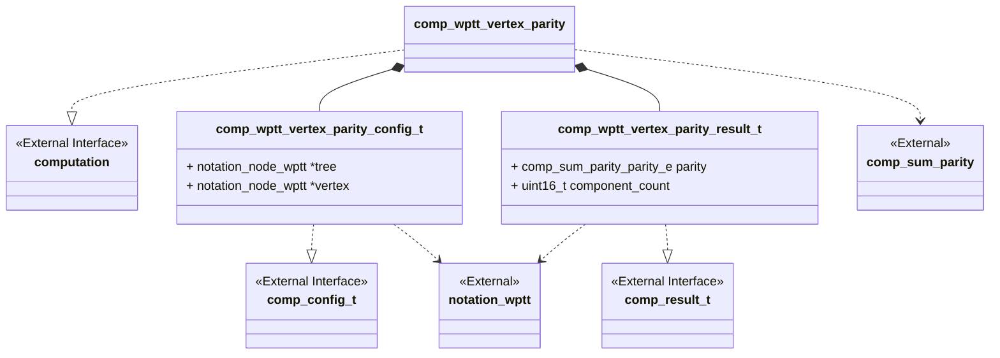
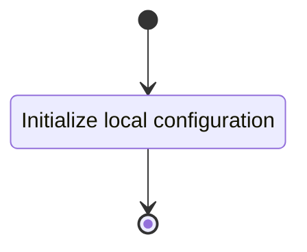
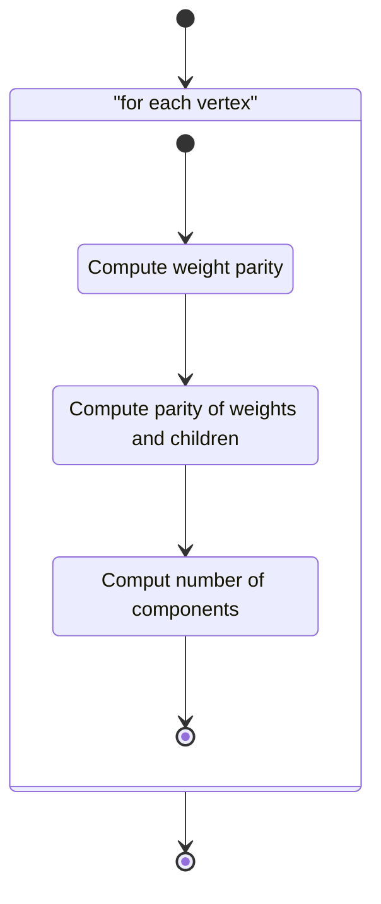

# Unit Description

## Class Diagram

## Language

C

## Implements

- [Computation Interface][interface-computation]

## Uses

- [Notation Weighted Planar Tangle Tree][note-wptt]

## Libraries

None

## Functionality

### Public Structures

#### Configuration Structure

The configuration structure contains the data needed for computing the parity of a vertex of an
input WPTT.

This includes:

- A pointer to the tree containing the vertex. This is used only for output to the write
    interface.
- A pointer to the parent of the vertex being examined.

#### Result Structure

The result structure contains the parity of the input vertex and a count of knotted components.

### Public Functions

#### Configuration Function

The configuration function sets the local configuration variable of the computation.

This process is described in the following state machines:

#### Compute Function

The compute function carries out the arborescent tangle vertex parity computation as described in
the use-case. The function may contain submachines that can be broken out into functions in the
implementation. The walk the tree function should be implemented with a stack-based iterative
approach.

This process is described in the following state machines:

#### Result Function

When this function is invoked, the result of the vertex parity computation process is reported.

## Validation

### Configuration Function

#### Positive Tests

> [!test-card] "Valid Configuration"
>
> A valid configuration for the computation is passed to the function.
>
> **Inputs:**
>
>   - A valid configuration.
>
> **Expected Output:**
>
>    A positive response.

#### Negative Tests

> [!test-card] "Null Configuration"
>
> A null configuration for the computation is passed to the function.
>
> **Inputs:**
>
>   - A null configuration.
>
> **Expected Output:**
>
>    A negative response.

> [!test-card] "Null Configuration Parameters"
>
> A configuration with null parameters is passed to the function.
>
> **Inputs:**
>
>   - A configuration with null WPTT.
>
> **Expected Output:**
>
>    A negative response.

### Compute Function

#### Positive Tests

> [!test-card] "A valid configuration with null write interface"
>
> A valid configuration is set for the component with null write. The computation is executed and
> returns successfully.
>
> **Inputs:**
>
>   - A valid configuration is set.
>
> **Expected Output:**
>
>   - A positive response.

> [!test-card] "Identified vertex is canonical"
>
> A valid configuration with write function is set for the component. The computation executes and
> returns successfully.
>
> **Inputs:**
>
>   - Set a valid configuration with object vertex with the object vertex set to the root of the
>     following trees:
>     - $\LB3\RB$
>     - $\LB2\RB$
>     - $\LB1\RB$
>     - $\LB0\RB$
>     - $\LB-1\RB$
>     - $\LB-2\RB$
>     - $\LB-3\RB$
>     - $\LP1\LB3\RB1\LB2\RB2\LP\LB3\RB3\RP4\RP$
>     - $\LB3\ 0\RB$
>     - $\LB2\ 0\RB$
>     - $\LB1\ 0\RB$
>     - $\LB0\ 0\RB$
>     - $\LB-1\ 0\RB$
>     - $\LB-2\ 0\RB$
>     - $\LB-3\ 0\RB$
>
> **Expected Output:**
>
>   - A positive response.
>   - The following parities and components:
>     - $\LB3\RB\to\chi$ and $0$ components
>     - $\LB2\RB\to0$ and $0$ components
>     - $\LB1\RB\to\chi$ and $0$ components
>     - $\LB0\RB\to0$ and $0$ components
>     - $\LB-1\RB\to\chi$ and $0$ components
>     - $\LB-2\RB\to0$ and $0$ components
>     - $\LB-3\RB\to\chi$ and $0$ components
>     - $\LP 1\LB 3\RB 1\LB 2\RB 2\LP\LB 3\RB 3\RP 4\RP\to\infty$ and $1$ component
>     - $\LB3\ 0\RB\to\chi$ and $0$ components
>     - $\LB2\ 0\RB\to\infty$ and $0$ components
>     - $\LB1\ 0\RB\to\chi$ and $0$ components
>     - $\LB0\ 0\RB\to\infty$ and $0$ components
>     - $\LB-1\ 0\RB\to\chi$ and $0$ components
>     - $\LB-2\ 0\RB\to\infty$ and $0$ components
>     - $\LB-3\ 0\RB\to\chi$ and $0$ components

#### Negative Tests

> [!test-card] "Not Configured"
>
> The compute interface is called before configuration.
>
> **Inputs:**
>
>   - None.
>
> **Expected Output:**
>
>    A negative response.

### Result Function

#### Positive Tests

> [!test-card] "A valid configuration and computation"
>
> A valid configuration is set for the component. The computation is executed and returns
> successfully. The resulting values are correct when read from the result interface.
>
> **Inputs:**
>
>   - Set a valid configuration with object vertex with the object vertex set to the root of the
>     following trees:
>     - $\LB3\RB$
>     - $\LB2\RB$
>     - $\LB1\RB$
>     - $\LB0\RB$
>     - $\LB-1\RB$
>     - $\LB-2\RB$
>     - $\LB-3\RB$
>     - $\LP1\LB3\RB1\LB2\RB2\LP\LB3\RB3\RP4\RP$
>     - $\LB3\ 0\RB$
>     - $\LB2\ 0\RB$
>     - $\LB1\ 0\RB$
>     - $\LB0\ 0\RB$
>     - $\LB-1\ 0\RB$
>     - $\LB-2\ 0\RB$
>     - $\LB-3\ 0\RB$
>
> **Expected Output:**
>
>   - A positive response.
>   - The following parities and components:
>     - $\LB3\RB\to\chi$ and $0$ components
>     - $\LB2\RB\to0$ and $0$ components
>     - $\LB1\RB\to\chi$ and $0$ components
>     - $\LB0\RB\to0$ and $0$ components
>     - $\LB-1\RB\to\chi$ and $0$ components
>     - $\LB-2\RB\to0$ and $0$ components
>     - $\LB-3\RB\to\chi$ and $0$ components
>     - $\LP 1\LB 3\RB 1\LB 2\RB 2\LP\LB 3\RB 3\RP 4\RP\to\infty$ and $1$ component
>     - $\LB3\ 0\RB\to\chi$ and $0$ components
>     - $\LB2\ 0\RB\to\infty$ and $0$ components
>     - $\LB1\ 0\RB\to\chi$ and $0$ components
>     - $\LB0\ 0\RB\to\infty$ and $0$ components
>     - $\LB-1\ 0\RB\to\chi$ and $0$ components
>     - $\LB-2\ 0\RB\to\infty$ and $0$ components
>     - $\LB-3\ 0\RB\to\chi$ and $0$ components

#### Negative Tests

> [!test-card] "Computation not executed"
>
> The result interface is called before compute has been run.
>
> **Inputs:**
>
>   - None.
>
> **Expected Output:**
>
>    A negative response.
