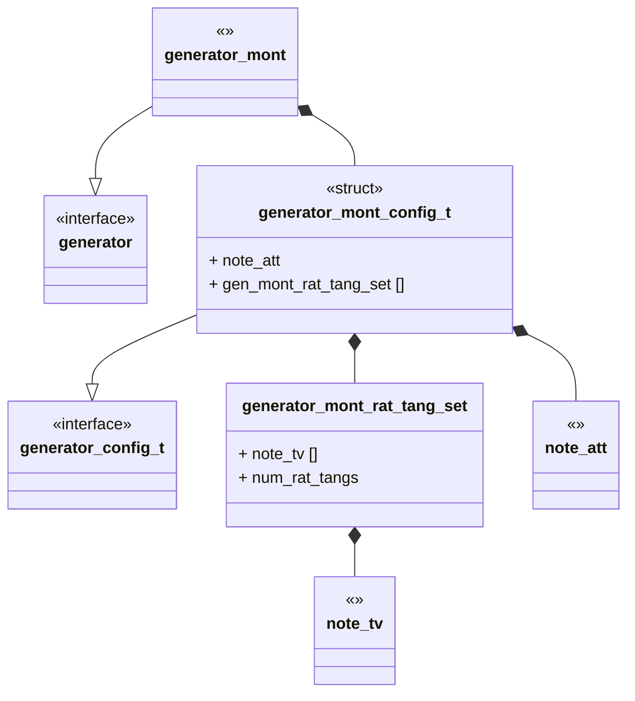
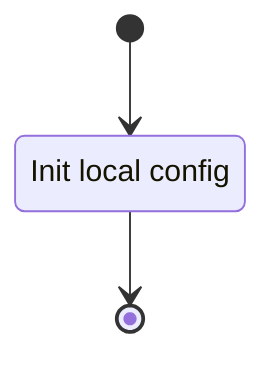
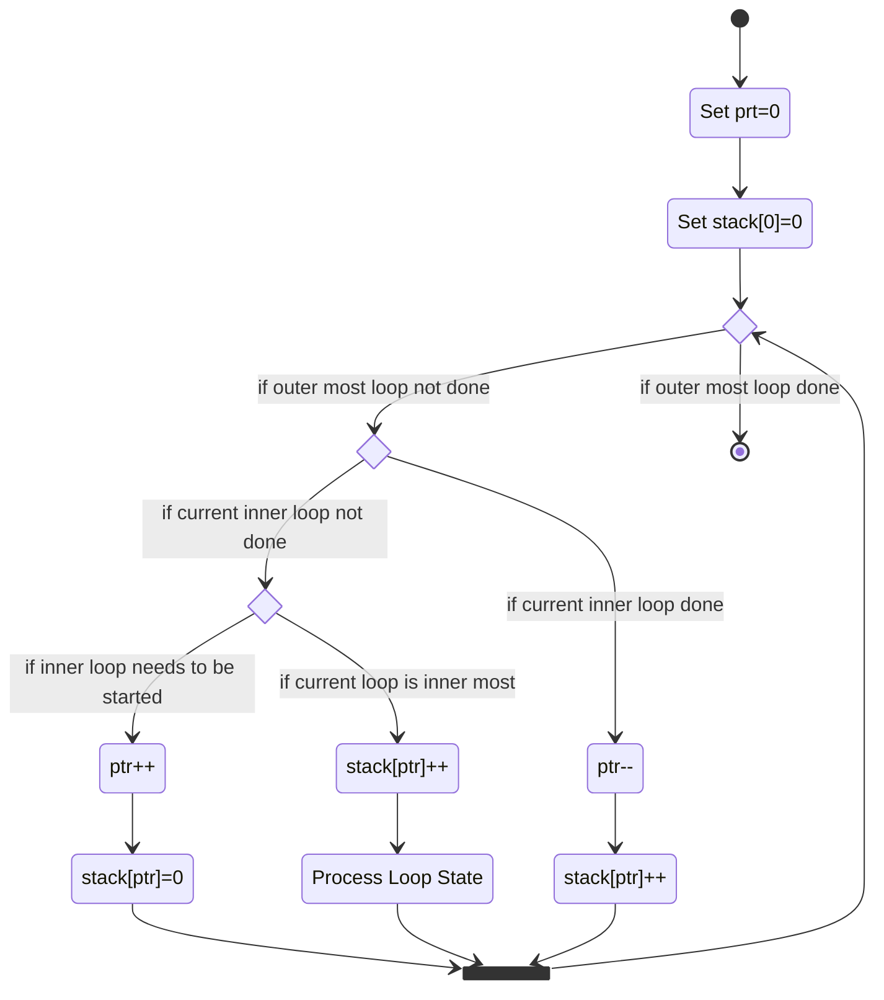
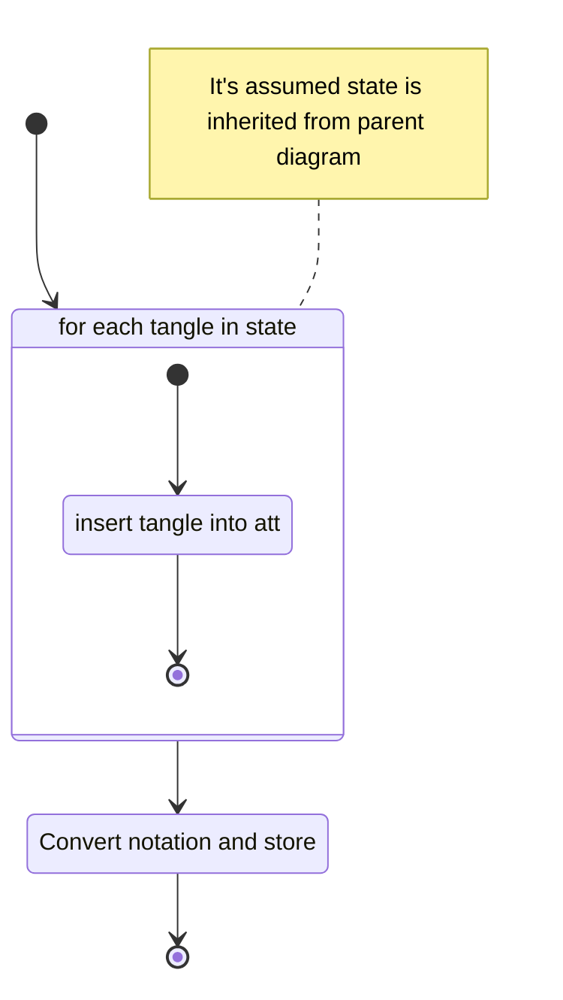

# @@@TODO Unit Description: Montesinos Tangle Generator



## Language

C

## Implements

- [Generator Interface](../../docs/unit_description/generators/interface.md)

## Uses

- [Twist Vector Notation](../note-twist_vector/twist_vector.md)
- [Algebraic Tangle Tree Notation](../note-algebraic_tangle_tree/algebraic_tangle_tree.md)

## Libraries

N/A

## Functionality

A canonical description of a Montesinos Knots is given by Bonahon and Siebenmann
in Theorem 11.6 of "New Geometric Splittings of Classical Knots and the
Classification and Symmetries of Arborescent Knots"
[${}^{[1]}$](https://dornsife.usc.edu/assets/sites/1191/docs/preprints/bonsieb.pdf).
The given construction can be modified to describe a canonical Montesinos
Tangle. That is a tangle with $n$ rational sub-tangles summed together with $+$,
with potentially $1$ integral tangle as the final sub-tangle. This means our
generation strategy for Montesinos tangles is to take combinations of our
rational tangles (non-integral), where the crossing numbers of the components
sum to the target crossing number.

```{important}


Algebraically:
$$[1 2 0]+[2 1 0]+[2 2 0]$$

att:
$$+[1 2 0]+[2 1 0][2 2 0]$$


```

This module generates att of unique Montesinos tangles. A normal flows go as:

### Config



### Generate



#### Process Loop State



## Cite

1. F. Bonahon and L. C. Siebenmann, “New Geometric Splittings of Classical Knots
   and the Classification and Symmetries of Arborescent Knots”. Version: January
   26, 2016
   [pdf](https://dornsife.usc.edu/assets/sites/1191/docs/preprints/bonsieb.pdf)

```{raw} latex
    \newpage
```
