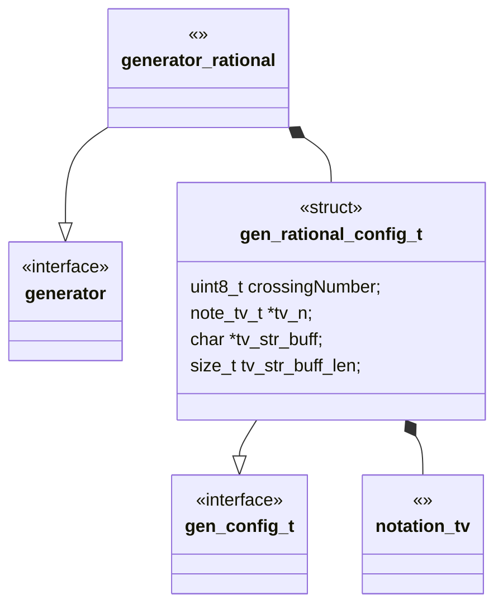
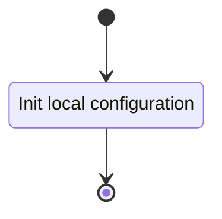
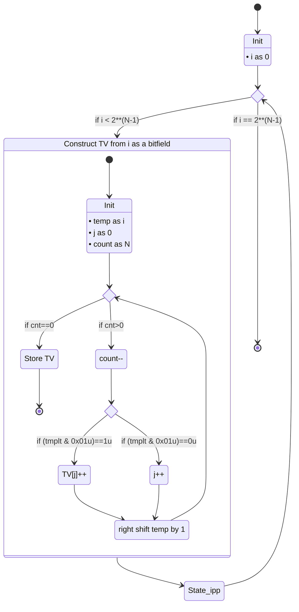

# Unit Description

## Class Diagram

## Language

C

## Implements

- [Generator Interface][interface-generator]

## Uses

- [Notation Twist Vector][note-twist_vector]

## Libraries

N/A

## Functionality

### Public Structures

#### Rational Generator Configuration Structure

The configuration structure contains the data needed for generating twist vectors up to a given
crossing number. This includes:

- An integer representation of the target crossing number.
- A notation structure for a twist vector.
- A string buffer for holding the stringified twist vector.

### Public Functions

#### Configuration Function

The configuration function sets the local configuration variable of the generator.

This process is described in the following state machines:

#### Generate Function

The generation function carries out the rational tangle generation until the target crossing number
is met. The function may contain sub-machines that can be broken out into functions in the
implementation.

This process is described in the following state machines:

## Validation

### Configuration Interface

#### Positive Tests

<!-- prettier-ignore-start -->

!!! test-card "Valid Configuration"

    A valid configuration for the generator is passed to the function.

    **Inputs:**

    - A valid configuration.

    **Expected Output:**

    A positive response.

<!-- prettier-ignore-end -->

#### Negative Tests

<!-- prettier-ignore-start -->

!!! test-card "Null Configuration"

    A null configuration for the generator is passed to the function.

    **Inputs:**

    - A null configuration.

    **Expected Output:**

    A negative response.

<!-- prettier-ignore-end -->

<!-- prettier-ignore-start -->

!!! test-card "A Configuration with null twist vector"

    A configuration with a null twist vector is passed to the function.

    **Inputs:**

    - A configuration with a null twist vector.

    **Expected Output:**

    A negative response.

<!-- prettier-ignore-end -->

<!-- prettier-ignore-start -->

!!! test-card "A Configuration with null string buffer"

    A configuration with a null string buffer is passed to the function.

    **Inputs:**

    - A configuration with a null string buffer.

    **Expected Output:**

    A negative response.

<!-- prettier-ignore-end -->

### Generate Interface

<!-- prettier-ignore-start -->

!!! test-card "Valid Configuration and generation"

    A valid configuration is set and the generation is called.

    **Inputs:**

    - A target crossing number of 5

    **Expected Output:**

    The twist vectors:

    - `[1 1 1 1 1]`
    - `[2 1 1 1 0]`
    - `[1 2 1 1 0]`
    - `[1 1 2 1 0]`
    - `[1 1 1 2 0]`
    - `[3 1 1]`
    - `[1 3 1]`
    - `[1 1 3]`
    - `[2 2 1]`
    - `[2 1 2]`
    - `[1 2 2]`
    - `[3 2 0]`
    - `[2 3 0]`
    - `[4 1 0]`
    - `[1 4 0]`
    - `[5]`

<!-- prettier-ignore-end -->
