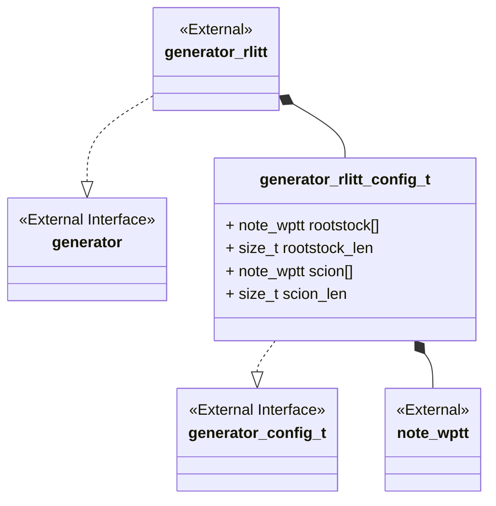
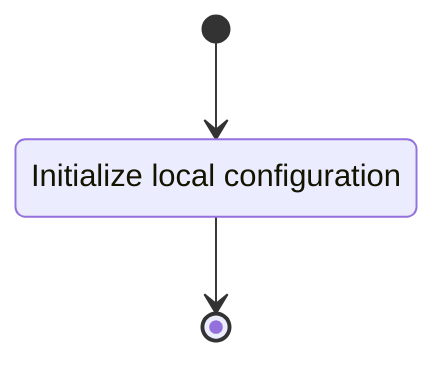
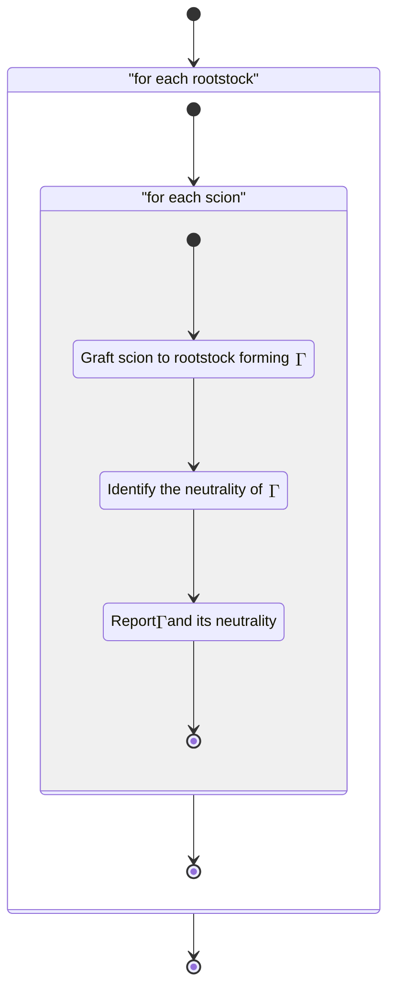

# Unit Description

## Class Diagram

## Language

C

## Implements

- [Generator Interface][interface-generator]

## Uses

- [Notation arborescent weighted planar tangle tree][note-wptt]
- [Computation Right Leaning Identify Tangle Tree Grafting][comp-rlitt_grafting]
- [Mutator Right Leaning Identify Tangle Tree Ring Shift][mut-rlitt_ringshift]
- [Computation Right Leaning Identify Tangle Tree Positivity][comp-rlitt_positivity]
- [Computation Weighted Planar Tangle Tree Vertex Canonicity][comp-wptt_vertex_canonicity]

## Libraries

None

## Functionality

### Public Structures

#### Arborescent Generator Configuration Structure

The configuration structure contains the data needed for generating a set of arborescent tangles
from a collection of arborescent rootstock and collection of arborescent good scions.

This includes:

- An array of WPTT rootstocks.
- A length for the array of WPTT rootstocks.
- An array of WPTT rootstock.
- An array of WPTT scions, these are assumed to be good.
- A length for the array of WPTT scions.
- An array of WPTT scions.

### Public Functions

#### Configuration Function

The configuration function sets the local configuration variable of the generator.

This process is described in the following state machines:

#### Generate Function

The generation function carries out the arborescent tangle generation until the inputs are
exhausted.

The grafting operation is carried out by a call to the computation \[grafting
component\][comp-rlitt_grafting], canonicity is determined by the \[vertex canonicity computation
component\][comp-wptt_vertex_canonicity], normalization of rings is carried out by the \[ring shift
component\][comp-rlitt_ringshift], and the positivity determination is carried out by the \[positivity
computation component\][comp-rlitt_positivitiy].

This process is described in the following state machines:

## Validation

### Configuration Function

#### Positive Tests

<!-- prettier-ignore-start -->

!!! test-card "Valid Configuration"

    A valid configuration for the generator is passed to the function.

    **Inputs:**

    - A valid configuration.

    **Expected Output:**

    A positive response.

<!-- prettier-ignore-end -->

#### Negative Tests

<!-- prettier-ignore-start -->

!!! test-card "Null Configuration"

    A null configuration for the generator is passed to the function.

    **Inputs:**

    - A null configuration.

    **Expected Output:**

    A negative response.

<!-- prettier-ignore-end -->

<!-- prettier-ignore-start -->

!!! test-card "Null Configuration Parameters"

    A configuration with various null parameters is passed to the function.

    **Inputs:**

    - A configuration with null rootstock.
    - A configuration with 0 rootstock_len.
    - A configuration with null scion.
    - A configuration with 0 scion_len.
    - A configuration with null str_buffer.
    - A configuration with 0 str_buffer_len.

    **Expected Output:**

    A negative response.

<!-- prettier-ignore-end -->

### Generate Function

#### Positive Tests

<!-- prettier-ignore-start -->

!!! test-card "Valid Configuration and Generation"

    A valid configuration is set and the generation is called.

    **Inputs:**

    - The rootstock list
        - $\iota\LB 1\RB$
        - $\iota\LP\LB2\RB \LB3\RB 4\RP$
    - The scion list
        - $\iota\LB 5\RB$
        - $\iota\LP\LB6\RB \LB7\RB 8\RP$

    **Expected Output:**

    The algebraic tangle trees:

    - $\iota\LB5\ 1\RB$
    - $\iota\LP\LP\LB 6\RB\LB 7\RB 8\RP 1\RP$
    - $\iota\LP\LB2\RB\LB3\RB\LB5\RB 4\RP$
    - $\iota\LP\LB2\RB\LB3\RB\LP\LB6\RB\LB7\RB8\RP4\RP$

<!-- prettier-ignore-end -->

<!-- prettier-ignore-start -->

!!! test-card "Generation of low crossing number"

    A valid configuration is set and the generation is called to compute up to 5 crossings.

    **Inputs:**

    - All tangles up to $4$ crossings.

    **Expected Output:**

    All tangles up to $5$ crossings.

<!-- prettier-ignore-end -->

#### Negative Tests

<!-- prettier-ignore-start -->

!!! test-card "Not Configured"

    The generate interface is called before configuration.

    **Inputs:**

    - None.

    **Expected Output:**

    A negative response.

<!-- prettier-ignore-end -->
