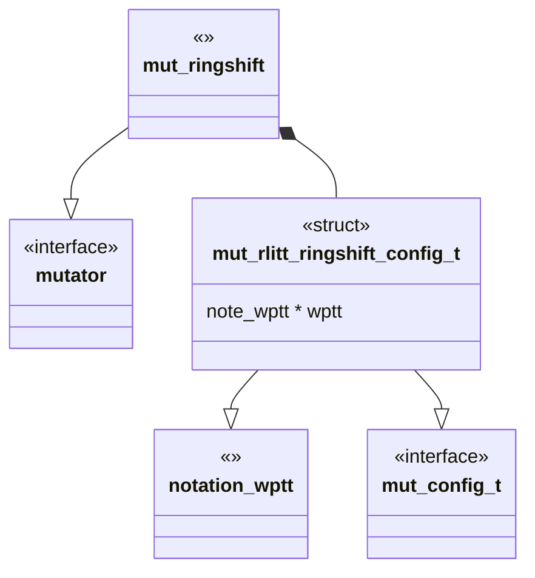
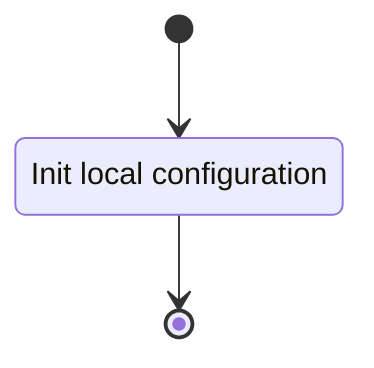
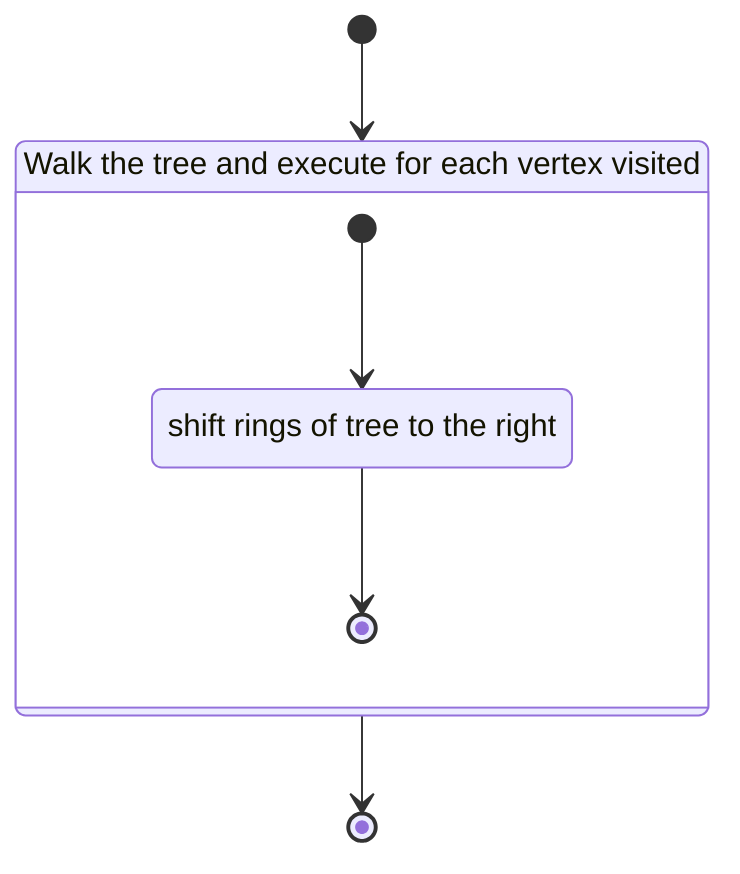

# Unit Description

## Class Diagram

## Language

C

## Implements

- [Mutator Interface][interface-mutator]

## Uses

- [Notation Weighted Planar Tangle Tree][note-wptt]

## Libraries

None

## Functionality

### Public Structures

#### Configuration Structure

The configuration structure contains the data needed for mutating the tree with $R^\pm$.

This includes:

- A pointer to a notation structure for a WPTT.

### Public Functions

#### Configuration Function

The configuration function configures the local instance variable of the mutation.

This process is described in the following state machines:

#### Mutate Function

The mutate function carries out the arborescent tangle ring shift mutation. The function may contain
submachines that can be broken out into functions in the implementation.

This process is described in the following state machines:

### Private Functions

#### Sort Children

The sort children function uses the C standard qsort function to sort the children vertices of the
object vertex.

## Validation

### Configuration Function

#### Positive Tests

<!-- prettier-ignore-start -->

!!! test-card "Valid Configuration"

    A valid configuration for the mutation is passed to the function.

    **Inputs:**

    - A valid configuration.

    **Expected Output:**

    A positive response.

<!-- prettier-ignore-end -->

#### Negative Tests

<!-- prettier-ignore-start -->

!!! test-card "Null Configuration"

    A null configuration for the mutation is passed to the function.

    **Inputs:**

    - A null configuration.

    **Expected Output:**

    A negative response.

<!-- prettier-ignore-end -->

<!-- prettier-ignore-start -->

!!! test-card "Null Configuration Parameters"

    A configuration with various null parameters is passed to the function.

    **Inputs:**

    - A configuration with null wptt.

    **Expected Output:**

    A negative response.

<!-- prettier-ignore-end -->

### Mutate Function

#### Positive Tests

<!-- prettier-ignore-start -->

!!! test-card "A valid configuration"

    A valid configuration is set for the component. The mutation is executed and
    returns successfully.

    **Inputs:**

    - A valid configuration is set.

    **Expected Output:**

    - A positive response.
    - Mutation is correct.

<!-- prettier-ignore-end -->

#### Negative Tests

<!-- prettier-ignore-start -->

!!! test-card "Not Configured"

    The mutate interface is called before configuration.

    **Inputs:**

    - None.

    **Expected Output:**

    A negative response.

<!-- prettier-ignore-end -->
