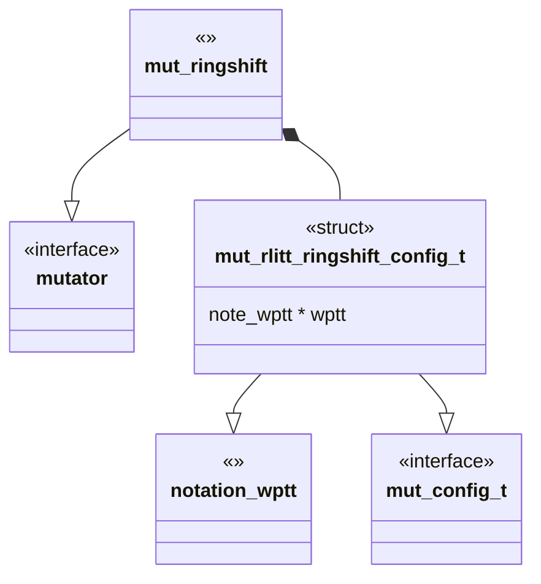
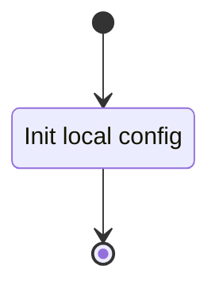
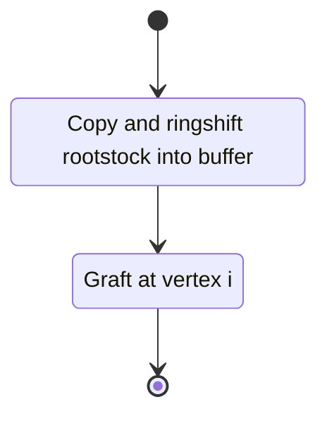
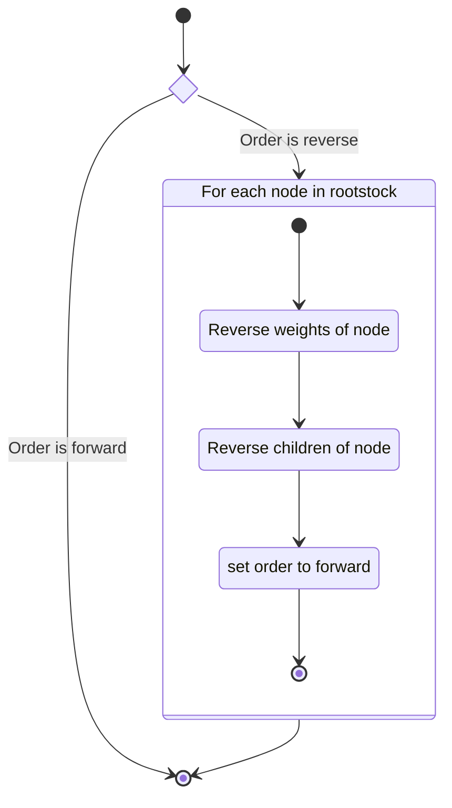
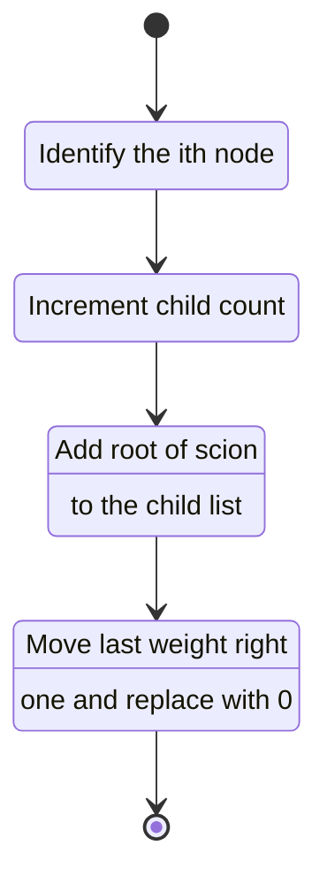

# Unit Description

## Class Diagram



## Language

C

## Implements

- [Computation Interface](#computation-interface)

## Uses

- [Notation Weighted Planar Tangle Tree](#note-wptt)

## Libraries

None

## Functionality

### Public Structures

#### Configuration Structure

The configuration structure contains the data needed for computing the tree with $R^\pm$ applied.

This includes:

- A pointer to a notation structure for a WPTT.

### Public Functions

#### Configuration Function

The configuration function configures the local instance variable of the computation.

This process is described in the following state machines:



#### Compute Function

The compute function carries out the arborescent tangle ring shift computation. The function may
contain sub machines that can be broken out into functions in the implementation.

This process is described in the following state machines:



### Private Functions

### Normalize Rootstock

The ringshift rootstock function rearranges the nodes of the rootstock so that each node has
forwarded order. This is accomplished by reversing the child and weight list, then setting the order
to forward in every node that has order reverse.



#### Graft Scion to Rootstock

This function carries out the



## Validation

### Configuration Function

#### Positive Tests

```{test-card} Valid Config

A valid configuration for the computation is passed to the function.

**Inputs:**

- A valid config.

**Expected Output:**

A positive response.

```

#### Negative Tests

```{test-card} Null Config

A null configuration for the computation is passed to the function.

**Inputs:**

- A null config.

**Expected Output:**

A negative response.

```

```{test-card} Null Configuration Parameters

A configuration with various null parameters is passed to the function.

**Inputs:**

- A configuration with null rootstock.
- A configuration with null scion.

**Expected Output:**

A negative response.

```

### Compute Function

#### Positive Tests

```{test-card} A valid config

A valid configuration is set for the component. The computation is executed and
returns successfully. The result written to the write interface is correct

**Inputs:**

- A valid configuration is set.

**Expected Output:**

- A positve response.
- A correct output on the write interface.

```

```{test-card} A valid configuration with null write interface

A valid configuration is set for the component with null write. The computation is
executed and returns successfully.

**Inputs:**

- A valid configuration is set.

**Expected Output:**

- A positve response.

```

#### Negative Tests

```{test-card} Not Configured

The compute interface is called before configuration.

**Inputs:**

- None.

**Expected Output:**

A negative response.

```

## Doxygen Documentation

```{doxygenfile} mut_rlitt_ringshift.h

```

```{doxygenfile} mut_rlitt_ringshift.c

```

## Bibliography

```{bibliography}
   :filter: docname in docnames
```

```{raw} latex
    \newpage
```
