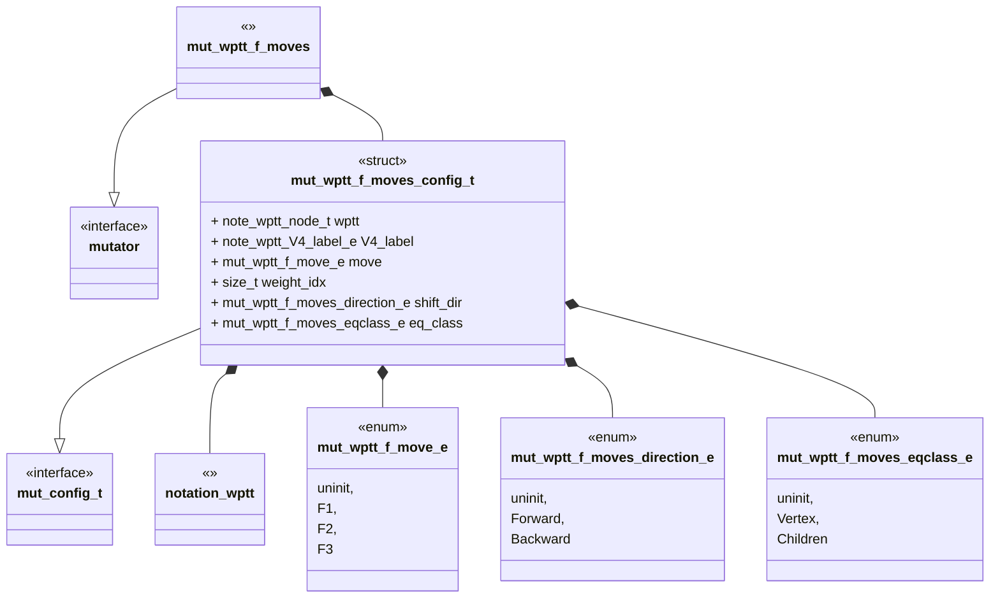
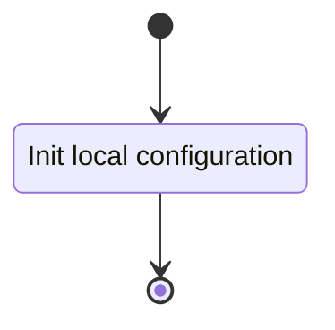
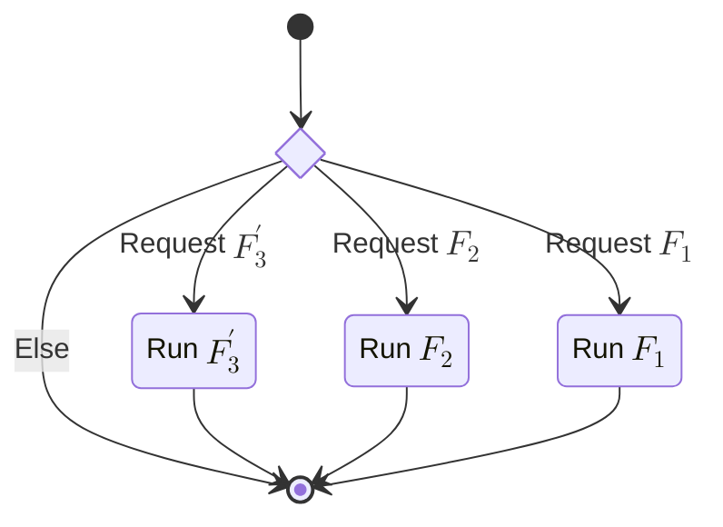
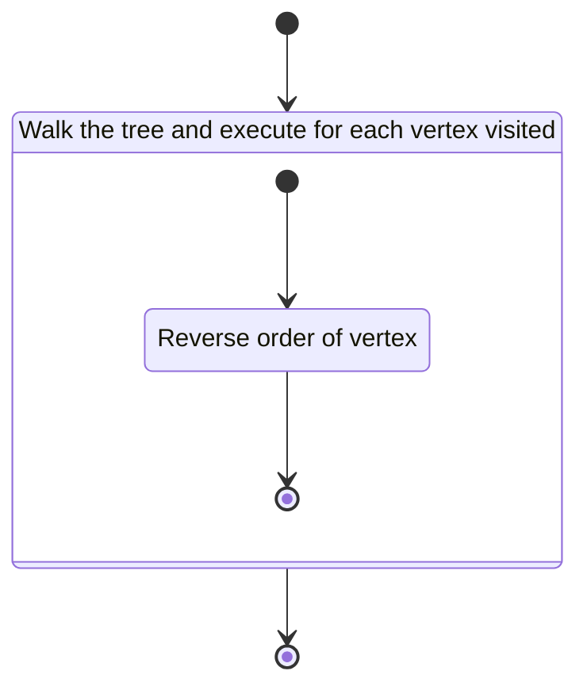
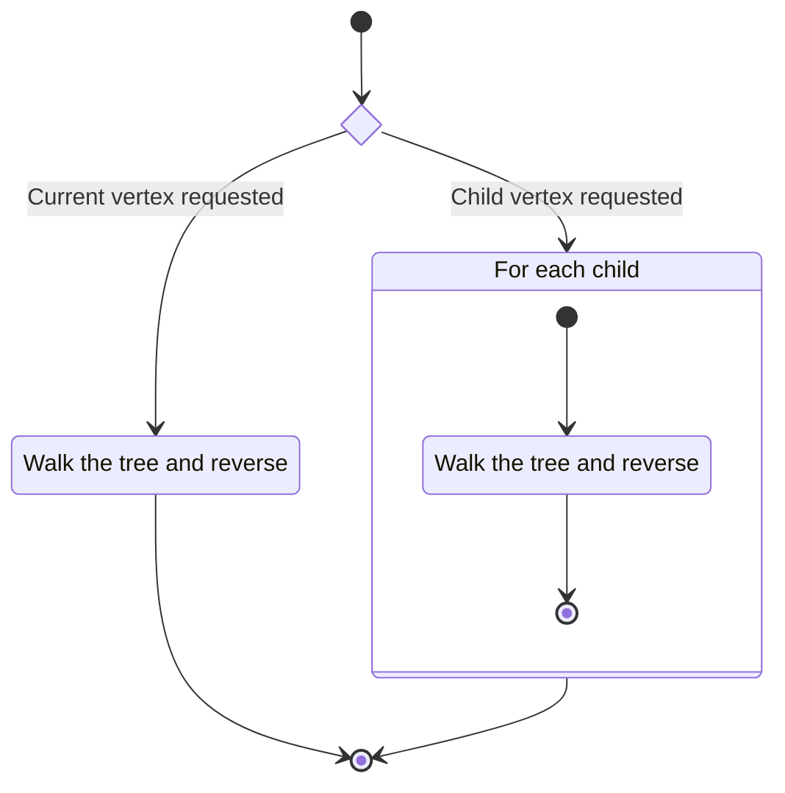
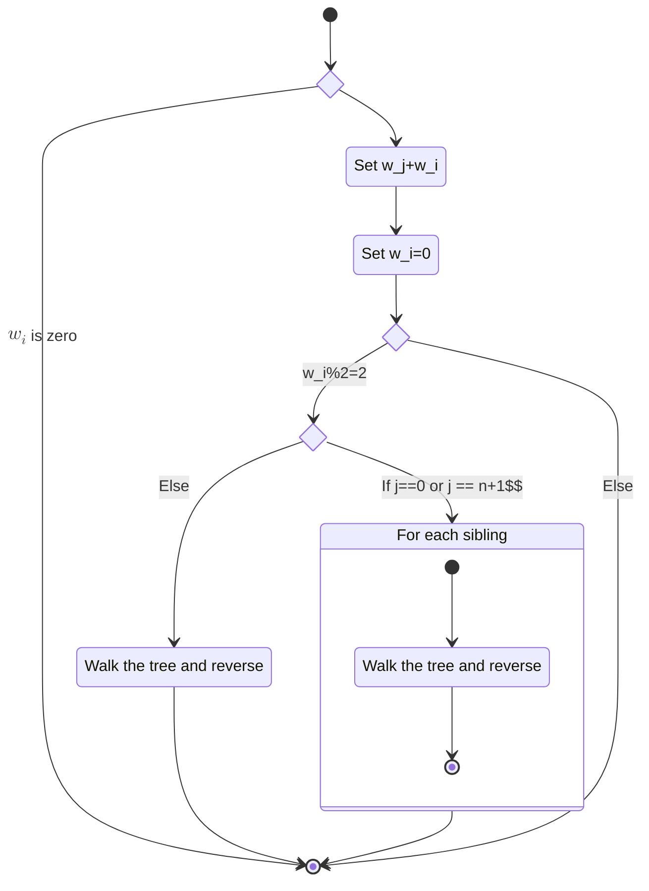

# Unit Description

```{note}
A block diagram for the component under development
```



## Language

C

## Implements

- [Mutator Interface][interface-mutator]

## Uses

- [Notation Weighted Planar Tangle Tree][note-wptt]

## External Libraries

None

## Functionality

### Public

#### Structures

##### Configuration Structure

The configuration structure contains the data needed for mutating a tree with the $F_1$, $F_2$, and
$F_3^\prime$ moves.

This includes:

- A pointer to a node in a WPTT.
- An indicator for which $F_i$ move to apply.
- The index for the weight to operate on.
- An indicator for which direction to shift the weight.
- An indicator for which equivalence class of vertex to operate on.

#### Functions

##### Configuration Function

The configuration function configures the local instance variable of the mutator.

This process is described in the following state machines:



##### Mutator Function

The mutator function carries out the arborescent tangle $F_i$ mutations. The function may contain
submachines that can be broken out into functions in the implementation.

This process is described in the following state machines:



### Private

#### Function

##### $F_1$

The state machine describing the flow and mutations for the $F_1$ move are as follows:



##### $F_2$

The state machine describing the flow and mutations for the $F_2$ move are as follows:



##### $F_3^\prime$

The state machine describing the flow and mutations for the $F_3^\prime$ move are as follows where
$i$ is assumed to to be the index of the weight $w_i$ to be acted on and $j$ is the index of the
destination index wrapping where needed:



##### Walk the Tree and Reverse

Walk the tree and execute the following for each vertex visited:

```{mermaid}
stateDiagram-v2
        state is_odd <<choice>>
        state "Reverse order of vertex" as ro
        [*]--> is_odd
        is_odd --> ro: Is odd stack count
        is_odd --> [*]: else
        ro --> [*]
```

## Validation

### Configuration Function

#### Positive Tests

<!-- prettier-ignore-start -->

!!! test-card "Valid Configuration"

    A valid configuration for the mutation is passed to the function.

    **Inputs:**

    - A valid configuration.

    **Expected Output:**

    A positive response.

<!-- prettier-ignore-end -->

#### Negative Tests

<!-- prettier-ignore-start -->

!!! test-card "Null Configuration"

    A null configuration for the mutation is passed to the function.

    **Inputs:**

    - A null configuration.

    **Expected Output:**

    A negative response.

<!-- prettier-ignore-end -->

<!-- prettier-ignore-start -->

!!! test-card "Invalid Configuration Parameters"

    A configuration with various null parameters is passed to the function.

    **Inputs:**

    - A configuration with null vertex.
    - A configuration with an uninitialized move.
    - Configurations for the $F_1$ move with:
        - Null label
        - Uninitialized label
    - Configurations for the $F_2$ move with:
        - Null label
        - Uninitialized label
        - Uninitialized eqclass
    - Configurations for the $F_3^\prime$ move with:
        - Uninitialized direction

    **Expected Output:**

    A negative response.

<!-- prettier-ignore-end -->

### Mutate Function

#### Positive Tests

<!-- prettier-ignore-start -->

!!! test-card "A valid configuration"

    A valid configuration is set for the component. The mutation is executed and
    returns successfully.

    **Inputs:**

    - A valid configuration is set for $F_1$.
    - Valid configurations are set for $F_2$:
        - Eqclass is child.
        - Eqclass is self.
    - Valid configurations are set for $F_3^\prime$ with at least one test suming two weights:
        - Odd weight:
            - Index is rightmost:
                - Direction is forward.
                - Direction is backward.
            - Index is leftmost:
                - Direction is forward.
                - Direction is backward.
        - Even weight:
            - Index is rightmost:
                - Direction is forward.
                - Direction is backward.
            - Index is leftmost:
                - Direction is forward.
                - Direction is backward.

    **Expected Output:**

    - A positive response.
    - Mutation is correct.

<!-- prettier-ignore-end -->

#### Negative Tests

<!-- prettier-ignore-start -->

!!! test-card "Not Configured"

    The mutate interface is called before configuration.

    **Inputs:**

    - None.

    **Expected Output:**

    A negative response.

<!-- prettier-ignore-end -->

<!-- prettier-ignore-start -->

!!! test-card "Double Execute"

    The mutate interface is called without reconfiguring the module.

    **Inputs:**

    - None.

    **Expected Output:**

    A negative response.

<!-- prettier-ignore-end -->

<!-- prettier-ignore-start -->

!!! test-card "$F_3^\prime$ index out of bounds"

    The mutate interface is called with a weight index configured outside
    of the size of the number of children.

    **Inputs:**

    - Configuration with weight idx outside bounds.

    **Expected Output:**

    A negative response.

<!-- prettier-ignore-end -->
