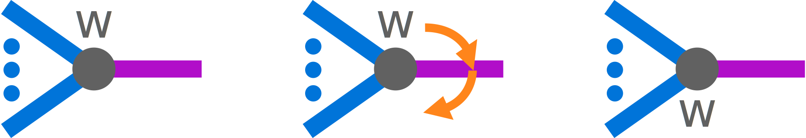

# Use Case

## Functionality

### Mathematical Description

Bonahon and Siebenmann define a collection of moves on
[weighted planar tangle trees (WPTT)](#note-wptt) that preserve the isotopy type of the underlying
tangle. This component realizes three of those moves: $F_3^\prime$, $F_2$, and $F_1$.

<!-- prettier-ignore-start -->
:::{prf:definition} Bonahon and Seibenmann Section 12.7.3 {cite:p}`bonahonNewGeometricSplittings2016`
:label: wpt-moves-def-f3p_move
<!-- prettier-ignore-end -->

The **$F_3^\prime$ move** on a weighted arborescent tree moves a weight $w$ as
 and, if $w$ is odd, reverse the cyclic order of weights and
bonds at all vertices of the purple subtree lying at odd distance (count of edges between two
vertices) from the vertex shown. Also, when $w$ is odd, apply $\xi$ ( $X$-axis rotation) to all free
bonds in the purple subtree that are attached to a vertex at even distance from the vertex shown,
and $\eta$ ($Y$-axis rotation) to those at odd distance. The rotations are relative to the
orientation of the plumbing square (Conway sphere) of the band being acted on.

:::

<!-- prettier-ignore-start -->
:::{prf:definition} Bonahon and Seibenmann Section 12.7.1 {cite:p}`bonahonNewGeometricSplittings2016`
:label: uc-c-f2-d-f2_t
<!-- prettier-ignore-end -->

The **$F_2$ move** on a weighted arborescent tangle tree reverses the cyclic order of bonds and
weights at one vertex on the tree and at every vertex at even distance from it; also apply $\eta$
($Y$-axis rotation) to every free bond of a vertex at even (or zero) distance, and apply $\xi$
($X$-axis rotation) to every free bond at odd distance. The rotations are relative to the
orientation of the plumbing square (Conway sphere) of the band being acted on.

:::

<!-- prettier-ignore-start -->
:::{prf:definition} Bonahon and Seibenmann Section 12.7.1 {cite:p}`bonahonNewGeometricSplittings2016`
:label: uc-c-f1-d-f1_t
<!-- prettier-ignore-end -->

The **$F_1$ move** on a weighted arborescent tangle tree reverses the cyclic order of bonds and
weights at every vertex of the graph and applies $\zeta$ ($Z$-axis rotation) to every free bond. The
rotations are relative to the orientation of the plumbing square (Conway sphere) of the band being
acted on.

:::

### Computational Description

A computational framing of the moves on a [weighted planar tangle trees (WPTT)](#note-wptt) is
slightly problematic. The notational WPTT is formed by a collection of singly linked lists where
parents point to children. This directional linkage means moving "up" a tree from child to parent is
functionally difficult. This requires special handling for each of the moves. When a $F_3^\prime$
shift is requested over a parent connection, we will instead model the shift as the equivalent
collection of $F_3^\prime$ moves in the opposite direction. Next, for the $F_1$ and $F_2$ moves, we
will assume that the vertex passed to the mutator is the root vertex. Our final consideration is for
the $F_2$ move, we must indicate weather to operate on the equivalence class of the indicate vertex
or that of its children.

## Bibliography

```{bibliography}
   :filter: docname in docnames
```

```{raw} latex
    \newpage
```

```

```

```

```
