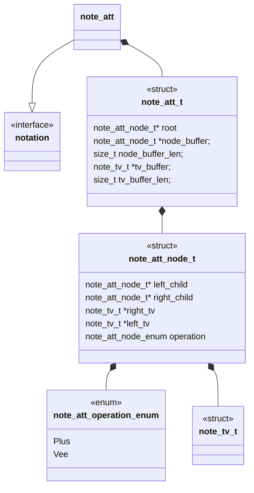
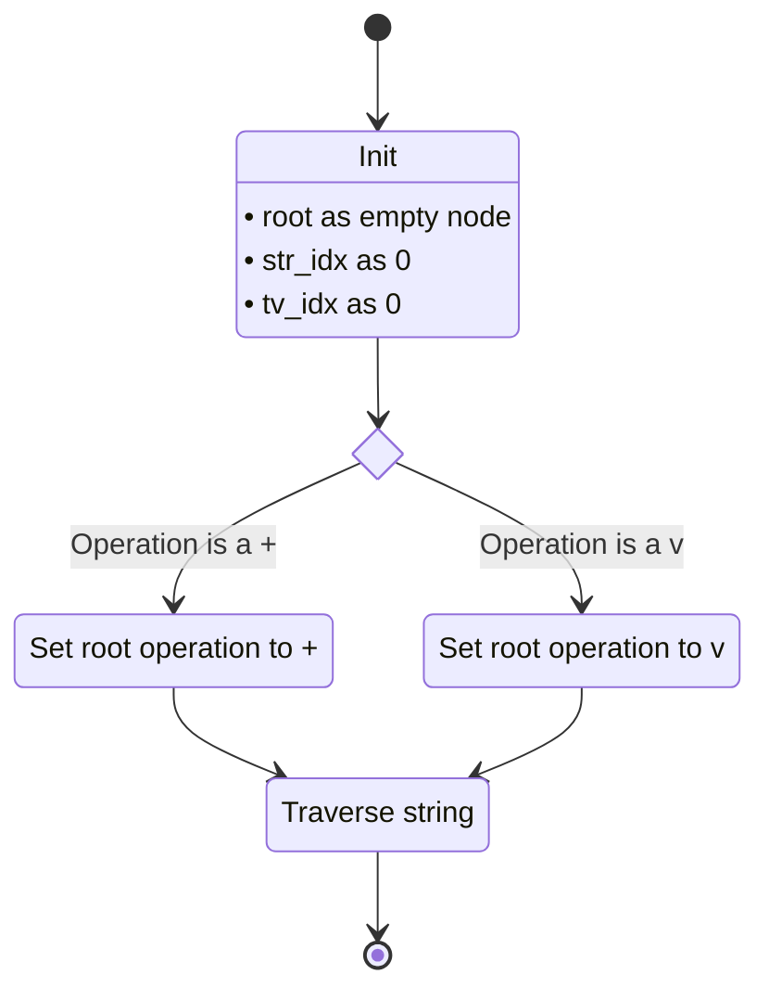
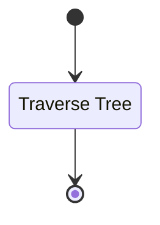
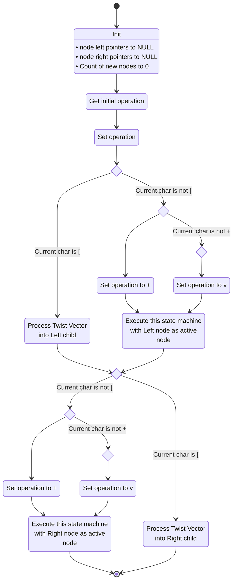
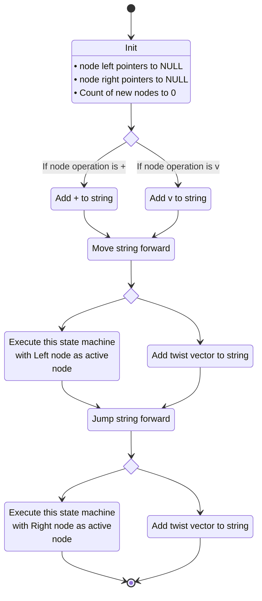

# Unit Description

## Class Diagram

## Language

C

## Implements

- [Notations Interface][interface-notation]

## Uses

- [Twist Vector Interface][note-twist_vector]

## External Libraries

The algebraic tangle tree notation component does not use any external libraries.

## Functionality

### Public Structures

#### Notation Structure

The interface notation structure contains the data needed to store the data structure for an
algebraic tangle tree. The notation structure contains a pointer to the root node of an algebraic
tangle tree. Additionally, the notation interface contains two buffers for storing elements of the
tree. The first buffer is a node buffer for storing non-leaf nodes of a tree. The second is a twist
vector buffer for storing leaf nodes of the tree.

#### Node Structure

The second structure is the node structure. This structure defines the data needed by a non-leaf
node of an algebraic tangle tree. An algebraic tangle tree is a binary tree, for any node the
children of that node can be of two types. We store these possibilities with two sets of pointers.
First, pointers for left and right child nodes and second, pointers for left and right twist vector
leaf nodes. Additionally, each node must contain an operation, either $+$ or $\vee$. This operation
data is stored as a bit field.

| Operation | NA  | NA  | NA  | NA  | NA  | NA  | Op  | Op  |
| --------- | --- | --- | --- | --- | --- | --- | --- | --- |
| uninit    | 0   | 0   | 0   | 0   | 0   | 0   | 0   | 0   |
| Plus      | 0   | 0   | 0   | 0   | 0   | 0   | 0   | 1   |
| Vee       | 0   | 0   | 0   | 0   | 0   | 0   | 1   | 0   |

### Public Functions

#### Decode Function

The decode function takes in the linearized string form of the algebraic tangle tree and encodes it
as a `note_att_t`.

This process is described in the following state machines:

#### Encode Function

The encode function takes in a `note_tv_t` and encodes it into the linearized string form of the
algebraic tangle tree.

### Private Functions Decode Path

#### Traverse String

This function recursively processes a string into the non-root elements of an algebraic tangle tree.

### Private Functions Encode Path

#### Traverse Tree

This function recursively processes a string into the non-root elements of an algebraic tangle tree.

## Validation

### Decode Interface

<!-- prettier-ignore-start -->

!!! test-card "Valid string representing a algebraic tangle tree"

    A valid string representing a algebraic tangle tree is fed to the function.

    **Inputs:**

    - A valid string representing a algebraic tangle tree.

    **Expected Output:**

    A correct and valid decoding of the string

<!-- prettier-ignore-end -->

### Encode Interface

<!-- prettier-ignore-start -->

!!! test-card "Valid algebraic tangle tree"

    A valid algebraic tangle tree is fed to the function.

    **Inputs:**

    - A correct and valid algebraic tangle tree.

    **Expected Output:**

    A valid string representing the algebraic tangle tree.

<!-- prettier-ignore-end -->
