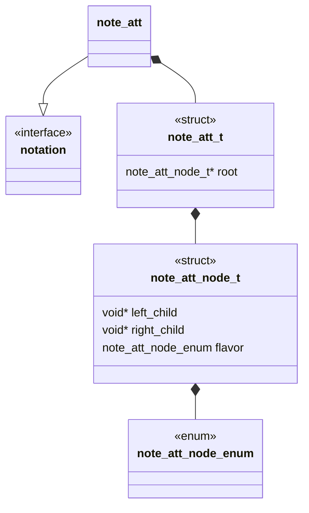

# @@@TODO Unit Description: Algebraic Tangle Tree Notation



## Language

C

## Implements

- [Notations Interface](../../docs/unit_description/notations/interface.md)

## Uses

N/A

## Libraries

N/A

## Functionality

An algebraic tangle is any tangle generated from an "algebraic" statement of the
two binary operations $+$ and $\vee$ on the four basic tangles
($0,\
\pm1,\ \infty$).

```{admonition} An example
:class: example

$$\LP\LP\infty+\infty\RP\vee\LP 0\vee0\RP\RP+\LP1+0\RP+\infty$$

```

To simplify the combinatorics we can Each of these

Given one of these algebraic statements interpret the algebraic statement as a
binary tree we will represent the generating statement in polish notation and
read the statement into a binary operation tree. Each non-leaf node of the
binary tree is assigned one of the two basic

````{hint}


Algebraically:
$$[1 2 0]+[2 1 0]+[2 2 0]$$

att "encoded":
$$+[1 2 0]+[2 1 0][2 2 0]$$


att "decoded":
   ```mermaid
   flowchart TD
   id0("+")-->id1("[1 2 0]")
   id0("+")-->id2("+")
   id2("+")-->id3("[2 1 0]")
   id2("+")-->id4("[2 2 0]")
   ```
````

Each non-leaf node of the tree is assigned one of a number "flavors" determined
by the state of a 6 bit bitfield.

The following table describes the significance of each bit in the field:

|        | Op  | Op  | Type R | Type R | Type L | Type L |
| ------ | --- | --- | ------ | ------ | ------ | ------ |
| Uninit | 0   | 0   | 0      | 0      | 0      | 0      |
| L Op   | 0   | 0   | 0      | 0      | 0      | 1      |
| L Tang | 0   | 0   | 0      | 0      | 1      | 0      |
| R Op   | 0   | 0   | 0      | 1      | 0      | 0      |
| R Tang | 0   | 0   | 1      | 0      | 0      | 0      |
| Plus   | 0   | 1   | 0      | 0      | 0      | 0      |
| Vee    | 1   | 0   | 0      | 0      | 0      | 0      |

### Data Structure Description

```{note}
It is important to note that we assume the minimal sub tangles of a tree are rational.
```

### Encoding

To encode the data to a string we need only traverse the tree and report with a
depth first preorder.

### Decoding

To decode a string to a tree we again interpret to a tree with depth first
preorder

## Cite

1. Caudron, Alain. Classification des noeuds et des enlacements. France, Univ.
   de Paris-Sud, Department de Math., 1982.
2. N. Connolly, "Classification and tabulation of 2-string tangles: the
   astronomy of subtangle decompositions," Doctor of Philosophy, University of
   Iowa, 2021. doi: 10.17077/etd.005978.

```{raw} latex
    \newpage
```
