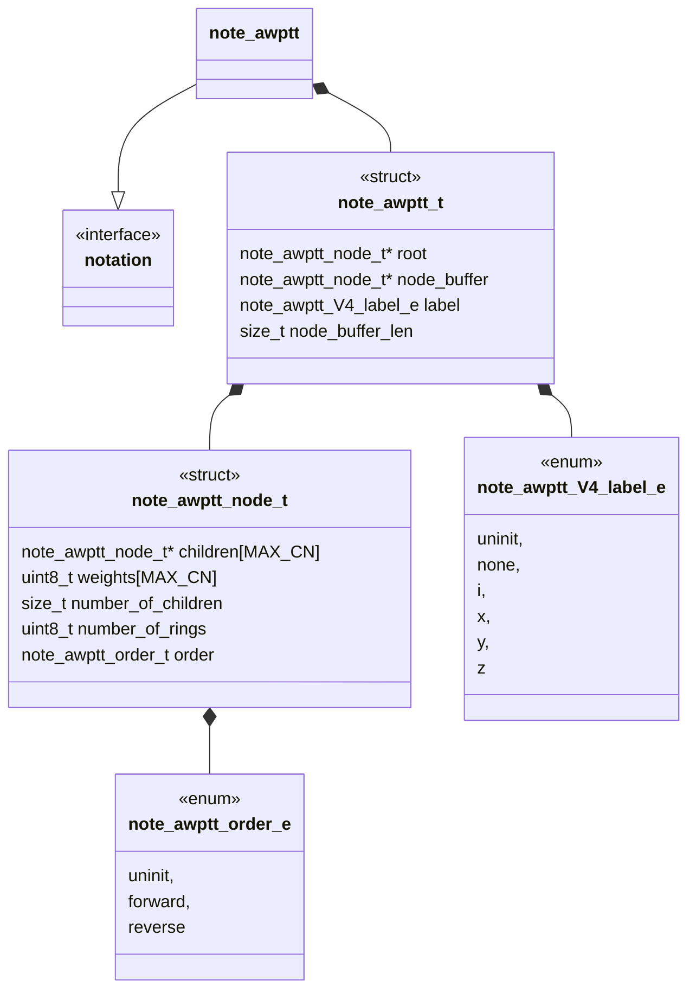
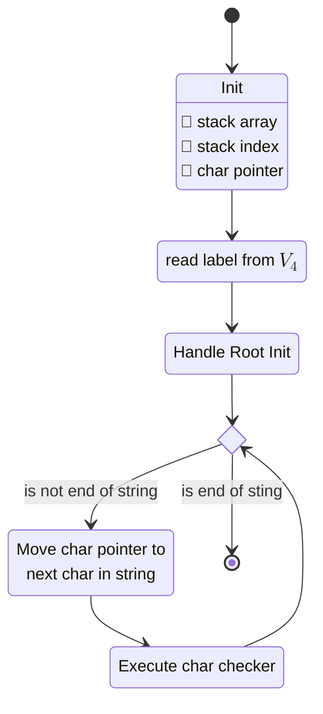
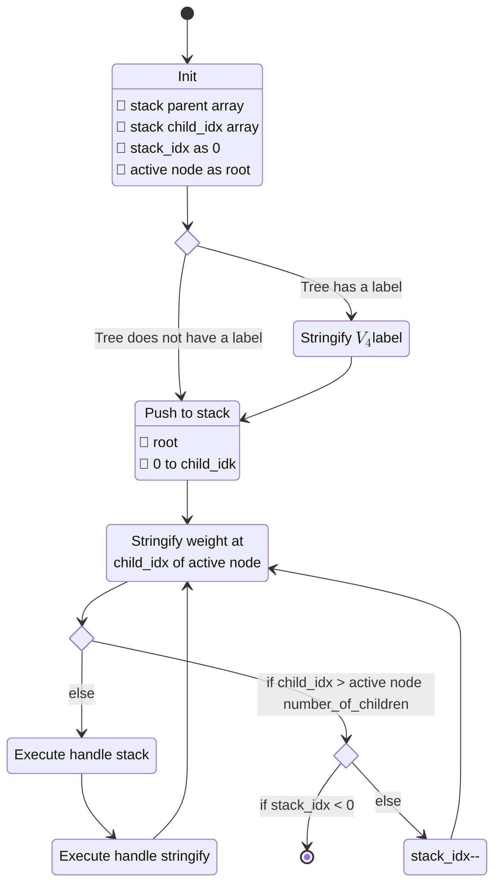
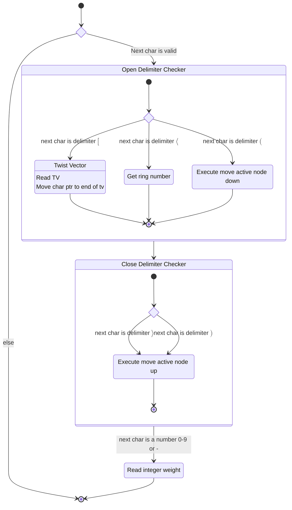
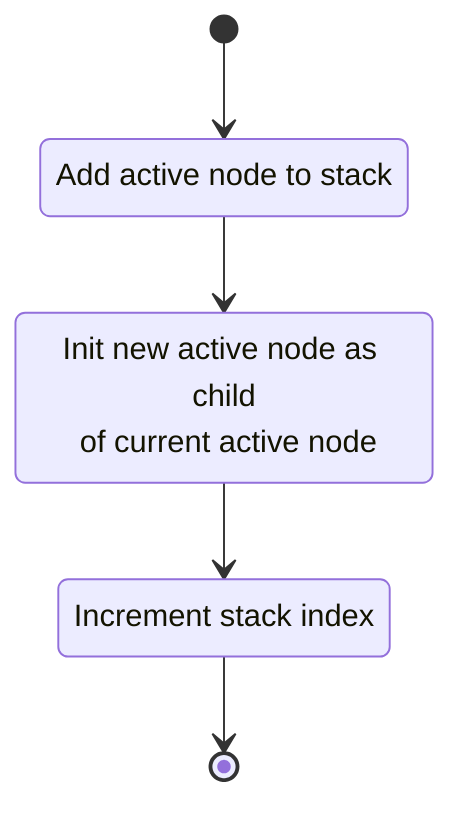
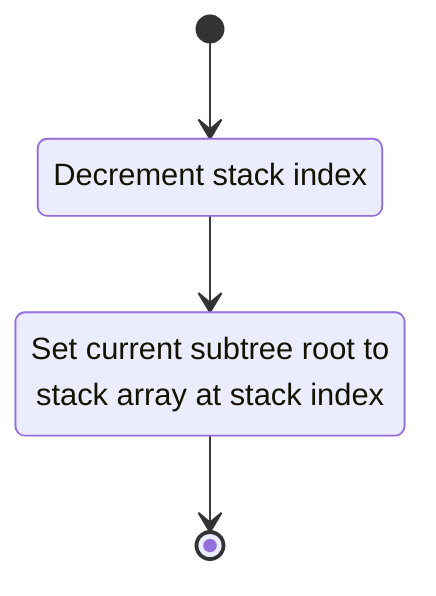
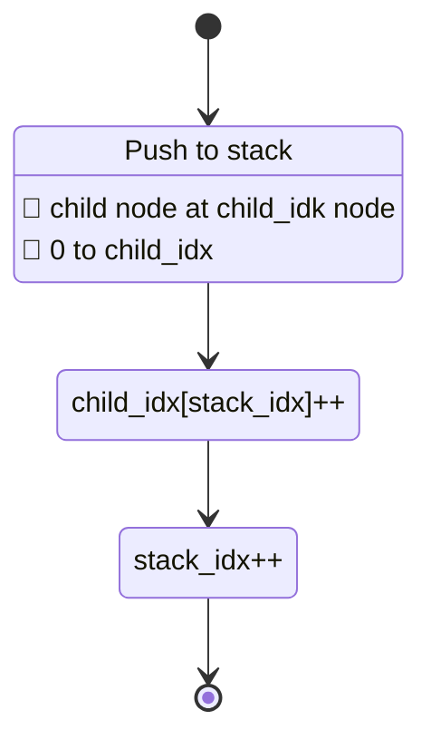
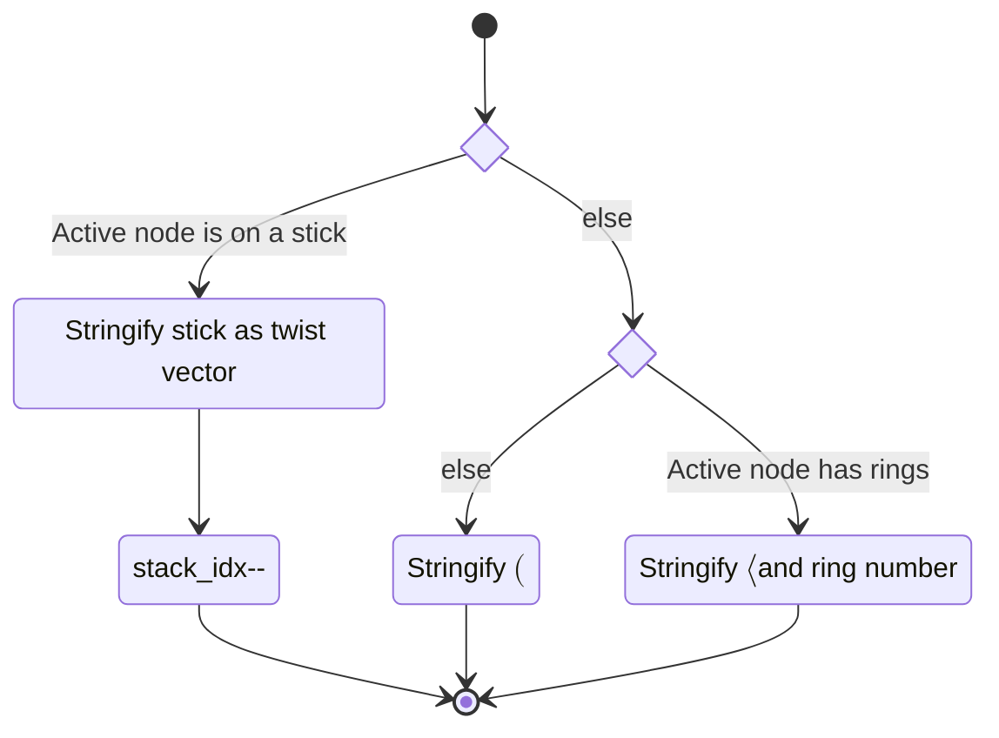

# Unit Description: Arborescent Weighted Planar Tangle Tree Notation



## Language

C

## Implements

- [Notations Interface](../../notation-interface.md)

## Uses

The AWPTT notation component does not use any other components.

## External Libraries

The AWPTT notation component does not use any external libraries.

## Functionality

### Public

#### Structures

##### Notation structure

The interface structure for the component is designed to match the non memory
allocating design goals of non-runner components. That means this notation
structure contains:

- A pointer to the root of the AWPTT
- A buffer of/for nodes in the AWPTT
- A length for the buffer supplied to the component instance
- A $V_4$ label for the AWPTT

##### Node structure

We saw in the use-case description an outline for the important data that needs
to be encoded in a AWPTT data structure. This data is summarized as:

- Children and their cyclic order
- Weights and their location in the cyclic order
- Number of rings

Each of these items are easy to encode in a C structure. The children (except
parent linkage) are encoded as an array of pointers to the children.
Additionally, this array implicitly encodes a cyclic order of the children by
the order in the array. Weights are encoded likewise in an array. Weight index
is interpreted as "after" the same child weight in order as seen below.

```{prf:example} Interleaved index

For child array $[c_0,c_1,\cdots,c_{n-1}]$ and weight array
$[w_0,w_1,\cdots,w_{n-1}]$. The order as described in the
[use-case](#linearize_a_vertex) is given as:

-   Forward $$w_0c_0w_1c_1\cdots w_{n-1}c_{n-1}w_{n}$$ Forward it the assumed
    default.
-   Reverse $$w_{n}c_{n-1}w_{n-1}\cdots,w_1c_1w_0, $$

```

Finally, read order is encoded as a simple enum consisting of:

- uninit
- forward
- reverse

This allows components to invert read order, read from $(n-1)\to 0$, at runtime.

#### Functions

##### decode function

The decode function takes in the linearized string form of the AWPTT and decodes
it as a `note_awptt_node_t`.

This process is described in the following state machines:



##### encode function

The encode function takes in a `note_awptt_node_t` and encodes it into the
linearized string form of the AWPTT.



### Private

#### Structures

The component has no private structures.

#### Functions

##### decode path

###### Char checker

This function checks a character passed to it and updates the current notation
instance with one of seven execution paths. These paths are based on the class
the character falls into:

- A delimiter
    - An opening delimiter
        - $\langle$
        - $[$
        - $($
    - A closing delimiter
        - $\rangle$
        - $)$
- An integer beginning with "0-9" or "-"
- A space character



###### Move active node down

This function moves the active node to be a child of the current node.
Functionally, this is the same as descending the AWPTT.



###### Move root up

This function moves the active node to be a parent of the current node.
Functionally, this is the same as ascending the AWPTT.



##### Encode path

###### Handle stack



###### Handle stringify



## Validation

### Decode interface

#### Positive Tests

```{test-card} Valid string representing a knot

A valid string representing a knot (no free bond) is fed to the function.

**Inputs:**

- A valid string representing a knot.
- A stick tree.
- A tree with an essential vertex.
- A tree with a vertex that has ring number.
- A tree with a vertex with more than one weight.

**Expected Output:**

A valid decoding of the string

```

```{test-card} Valid string representing a tangle

A valid string representing a tangle (with free bond) is fed to the function.

**Inputs:**

- A valid string representing a tangle with each label:
    - i
    - x
    - y
    - z
- A stick tree.
- A tree with an essential vertex.
- A tree with a vertex that has ring number.
- A tree with a vertex with more than one weight.

**Expected Output:**

A valid decoding of the string


```

#### Negative Tests

```{test-card} A malformed tree is fed to the function

Various malformed trees are fed to the function.

**Inputs:**

Malformed strings with the following characteristics:

- A missing closing delimiter.
- An unexpected character is in the string.
- The string has more weights than possible.
- An empty string.

**Expected Output:**

The function reports an error.


```

### Encode interface

#### Positive Tests

```{test-card} A valid knot AWPTT is fed to the function

A valid knot AWPTT (with no label) is fed to the encode function.

**Inputs:**

- A valid AWPTT representing a knot.
- A stick AWPTT.
- A AWPTT with an essential vertex.
- A AWPTT with a vertex that has ring number.
- A AWPTT with a vertex with more than one weight.

**Expected Output:**

The function produces the corresponding encoded string.

```

```{test-card} A valid tangle AWPTT is fed to the function

A valid tangle AWPTT (with label) is fed to the encode function.

**Inputs:**

- A valid AWPTT representing a tangle with each label:
    - i
    - x
    - y
    - z
- A stick AWPTT.
- A AWPTT with an essential vertex.
- A AWPTT with a vertex that has ring number.
- A AWPTT with a vertex with more than one weight.

**Expected Output:**

The function produces the corresponding encoded string.


```

#### Negative Tests

```{test-card} A malformed AWPTT is passed to the function

A malformed AWPTT is passed to the function.

**Inputs:**

- A NULL child is present
- A NULL root is present
- An UNINIT label is present

**Expected Output:**

The function will produce an error.

```

```{test-card} A NULL string buffer is passed

The output string buffer is a NULL pointer.

**Inputs:**

- A NULL pointer buffer is passed to the function

**Expected Output:**

The function will produce an error.
```

## Doxygen Documentation

```{doxygenfile} notation_awptt.h

```

```{doxygenfile} notation_awptt.c

```

## Bibliography

```{bibliography}
   :filter: docname in docnames
```

```{raw} latex
    \newpage
```

```

```
