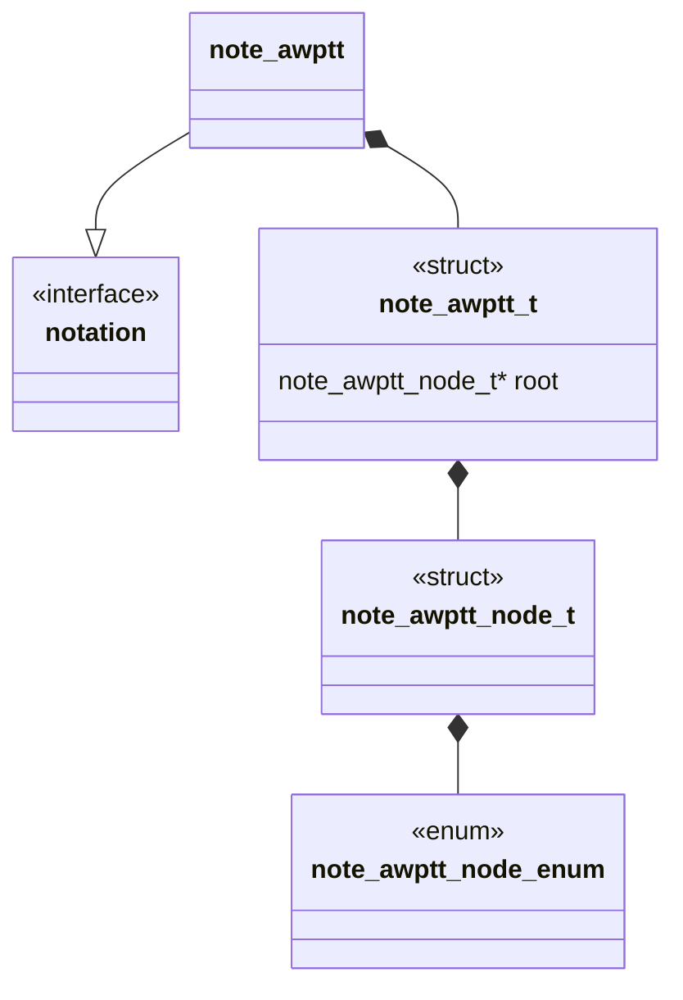

# Unit Description: Template

```{note}
A block diagram for the component under development
```



## Language

```{note}
A description of the language the feature is implemented in.
```

## Implements

```{note}
A list of interfaces implemented by the feature.
```
- [Notations Interface](../../docs/unit_description/notation-interface.md)

## Uses

```{note}
A list of compnents and libraries used by the feature.
```

## External Libraries

```{note}
A list of external compnents and libraries used by the feature.
```

## Functionality

```{note}
This section contains the function level description for component. This
description should sound very similar to the use-case. The key difference is
this section should be purely "how do I get the computer to satisfy the use-case".
Most likely this will contain algorithms and mermaid diagrams.
```

## Validation

```{note}
This section contains the unit level test description for the component. Each
test that will be implemented should be described here. This should happen at
the same time you are describing the functionality above, NOT after implementing
the features.
```

## Bibliography

```{bibliography}
   :filter: docname in docnames
```

```{raw} latex
    \newpage
```
