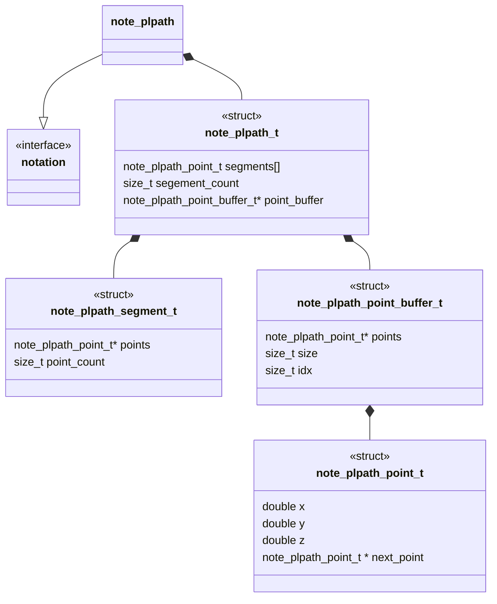
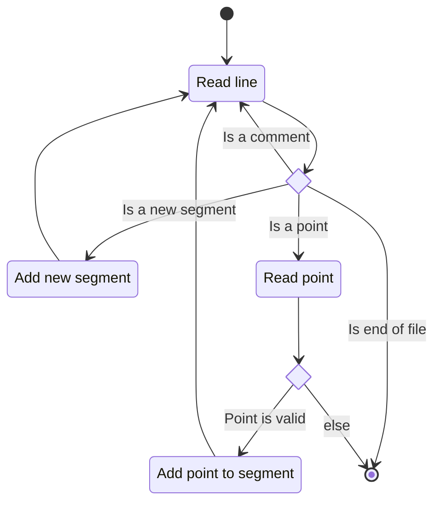
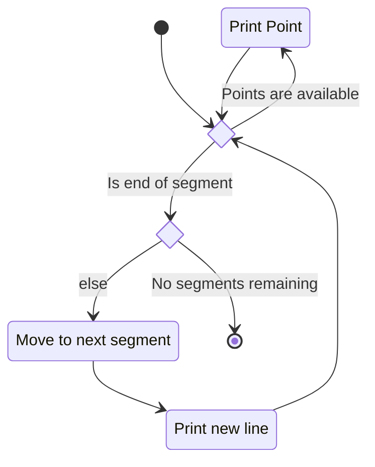

# Unit Description



## Language

C

## Implements

- [Notations Interface](../../notation-interface.md)

## Uses

The piecewise linear path notation component does not use any other components.

## External Libraries

The piecewise linear path notation component does not use any external libraries.

## Functionality

### Public

#### Structures

##### Notation Structure

The interface structure for the component is designed to match the non memory allocating design
goals of non-runner components. That means this notation structure contains:

- An array of piecewise linear path segments (a single connected component homotopic to a point or
  $S^1$)
- The size of the supplied list of segments
- A buffer of points to be used to build the piecewise linear path

```{warning}

This structure does not offer any guarantees on intersection (or self intersection). This means
that segments of a path may intersect (or self intersect).

```

##### Point Structure

The point structure contains a three tuple of doubles representing the $x,y,z$ coordinate of a point
on the path. The structure also contains a pointer to the "next" point in the segment.

#### Functions

##### Decode Function

The decode function takes in a string of the following form:

```
x,y,z
x,y,z
x,y,z

x,y,z
// A comment line
x,y,z
x,y,z
```

Where $x,y,z$ are string representations of floating-point numbers, `\n\n` indicates the beginning
of a new segment of the collection of PL paths, and a line starting with `//` indicates a comment
line.

```{warning}

Comments are lost when decoding the string. This means if you take a round trip (file -> decode -> encode)
the resulting string will have no comments.

```

This process is described in the following state machines:



##### Encode Function

The encode function takes in a `note_plpath_node_t` and encodes it into the linearized string form
of the piecewise linear path.



### Private

#### Structures

The component has no private structures.

#### Functions

The private functions of the component are straightforward.

## Validation

### Decode Interface

#### Positive Tests

```{test-card} Valid string representing a PL path

A valid string representing a PL path  is fed to the function.

**Inputs:**

- Valid strings representing a PL path:
    - A string with multiple segments
    - A string with a single segment
    - A string with comments
    - A string with no comments
    - A string with `\n\n\n`
    - A string with terminal `\n`
    - A string with no segments.

**Expected Output:**

A correct and valid decoding of the string

```

#### Negative Tests

```{test-card} A malformed PL path is fed to the function

A malformed PL path string is fed to the function.

**Inputs:**

Malformed strings with the following characteristics:

- An illegal character.
- An incomplete point.


**Expected Output:**

The function reports an error.

```

### Encode Interface

#### Positive Tests

```{test-card} Valid PL path

A valid PL path is fed to the function.

**Inputs:**

- A correct and valid PL path.

**Expected Output:**

A valid string representing the PL path.

```

#### Negative Tests

```{test-card} A NULL string buffer is passed

The output string buffer is a NULL pointer.

**Inputs:**

- A NULL pointer buffer is passed to the function

**Expected Output:**

The function will produce an error.
```

## Doxygen Documentation

```{doxygenfile} notation_plpath.h

```

```{doxygenfile} notation_plpath.c

```

## Bibliography

```{bibliography}
   :filter: docname in docnames
```

```{raw} latex
    \newpage
```

```

```
