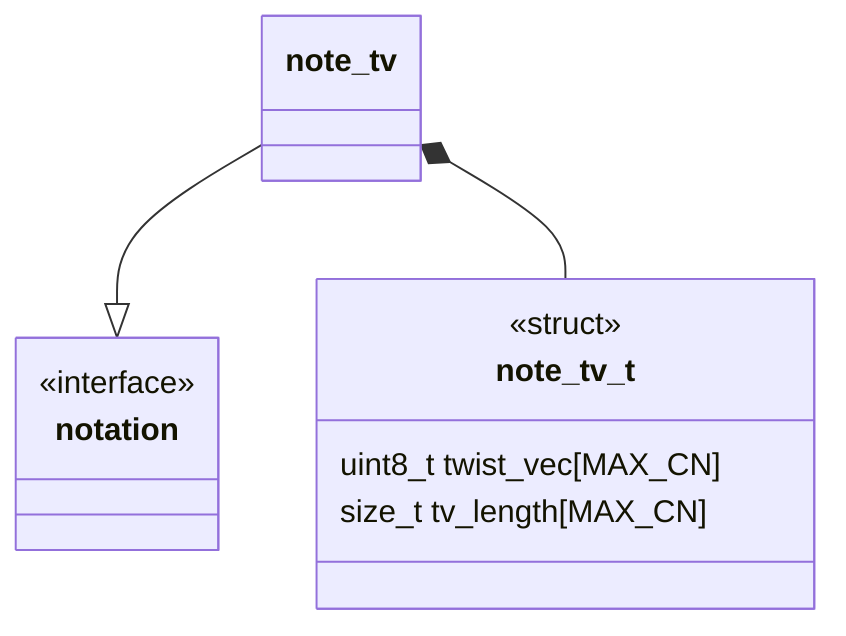
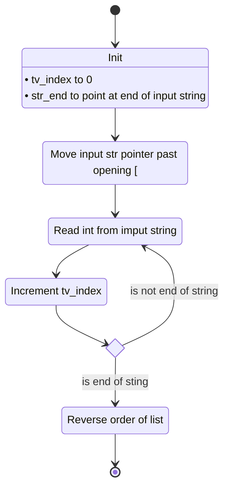
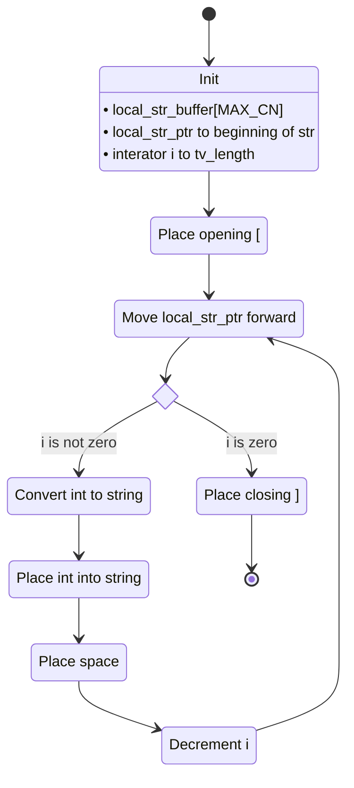
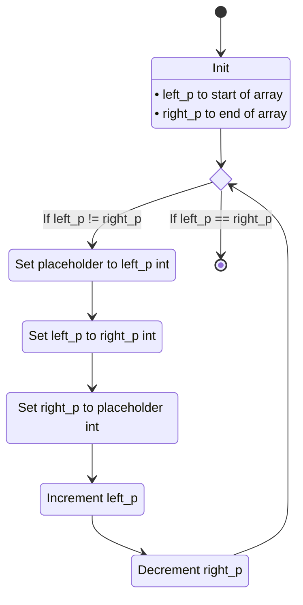

# Unit Description: Twist Vector Notation

## Class Diagram



## Language

C

## Implements

- [Notations Interface](../../notation-interface.md)

## Uses

The twist vector notation component does not use any other components.

## External Libraries

The twist vector notation component does not use any external libraries.

## Functionality

### Public Structures

#### Notation structure

The interface structure contains an array of integers, each entry of the twist
vector is stored into the array. The indexing of the array is as in
@se-tv-math-index.

```{math}
:label: se-tv-math-index
 [ x_n\ x_{n-1}\ \cdots\ x_0]\to \begin{array}{|c|c|c|c|} \hline
\text{0x0000}& & &\text{0x0000}+n\cdot \text{size\_t}\\\hline x_0&\cdots &
x_{n-1} &x_n\\ \hline \end{array}
```

### Public Functions

#### Decode Function

The decode function takes in the linearized string form of the twist vector and
encodes it as a `note_tv_t`.

This process is described in the following state machines:



#### Encode Function

The encode function takes in a `note_tv_t` and encodes it into the linearized
string form of the twist vector.



### Private Functions decode path

#### Twist Vector Reverse

This function reverses the order of the twist vector storage array. They makes
the increment read order match the theoretical indexing of the twist vector.



## Validation

### Decode interface

```{test-card} Valid string representing a twist vector

A valid string representing a twist vector is fed to the function.

**Inputs:**

- A valid string representing a twist vector.

**Expected Output:**

A correct and valid decoding of the string


```

### Encode interface

```{test-card} Valid twist vector

A valid twist vector is fed to the function.

**Inputs:**

- A correct and valid twist vector.

**Expected Output:**

A valid string representing the twist vector.

```

## Doxygen Documentation

```{doxygenfile} notation_tv.h

```

```{doxygenfile} notation_tv.c

```

## Bibliography

```{bibliography}
   :filter: docname in docnames
```

```{raw} latex
    \newpage
```
