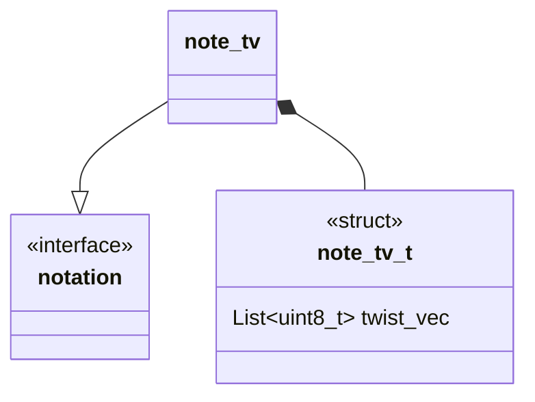

# @@@TODO Unit Description: Twist Vector Notation



## Language

C

## Implements

- [Notations Interface](../../docs/unit_description/notation-interface.md)

## Uses

N/A

## Libraries

N/A

## Functionality

A rational tangle is given by alternating NE,SE and SE,SW twisting of the $0$
tangle[${}^{[2]}$](https://doi.org/10.48550/arXiv.math/0212011)[${}^{[1]}$](https://doi.org/10.1016/B978-0-08-012975-4.50034-5).
Discussion of canonicality of this construction of twist vector can be found in
[${}^{[2]}$](https://doi.org/10.48550/arxiv.math/0212011). A twist vector
encodes these alternating twists as a list of integers.

> [!Example] Example Starting with the $0$ tangle
> ![[../../../media/0.svg | center | 200]] then twisting NE/SE clockwise 3 times
> SW/SE cockwise 2 times NE/SE clockwise 2 times we have
> ![[../../../media/Rational.svg | center | 200]] noted as $\LB3\ 2\ 2\RB$

### Data Structure Description

When encoding a twist vector as a string the standard indexing is
$\LB x_n\ x_{n-1}\ \cdots\ x_0\RB$ we follow the convention but align the
indexing to the array index, that is

$
$ \LB x*n\ x*{n-1}\ \cdots\ x*0\RB\to \begin{array}{|c|c|c|c|} \hline
\text{0x0000}& & &\text{0x0000}+n\cdot \text{size_t}\\\hline x_0&\cdots &
x*{n-1} &x_n\\ \hline \end{array} $
$

### Encoding

When encoding the data structure to a string we need to reverse the order we
read the twist vector array. This will left align the $0$ index in the string.

### Decoding

We need to insert entries into the twist vector data structure, to achieve this
we will traverse the string in reverse.

## Cite

1. Conway, J.H. “An Enumeration of Knots and Links, and Some of Their Algebraic
   Properties.” In _Computational Problems in Abstract Algebra_, 329–58.
   Elsevier, 1970.
   [https://doi.org/10.1016/B978-0-08-012975-4.50034-5](https://doi.org/10.1016/b978-0-08-012975-4.50034-5).
2. Kauffman, Louis H., and Sofia Lambropoulou. “On the Classification of
   Rational Knots,” 2002.
   [https://doi.org/10.48550/ARXIV.MATH/0212011](https://doi.org/10.48550/arxiv.math/0212011).

```{raw} latex
    \newpage
```
