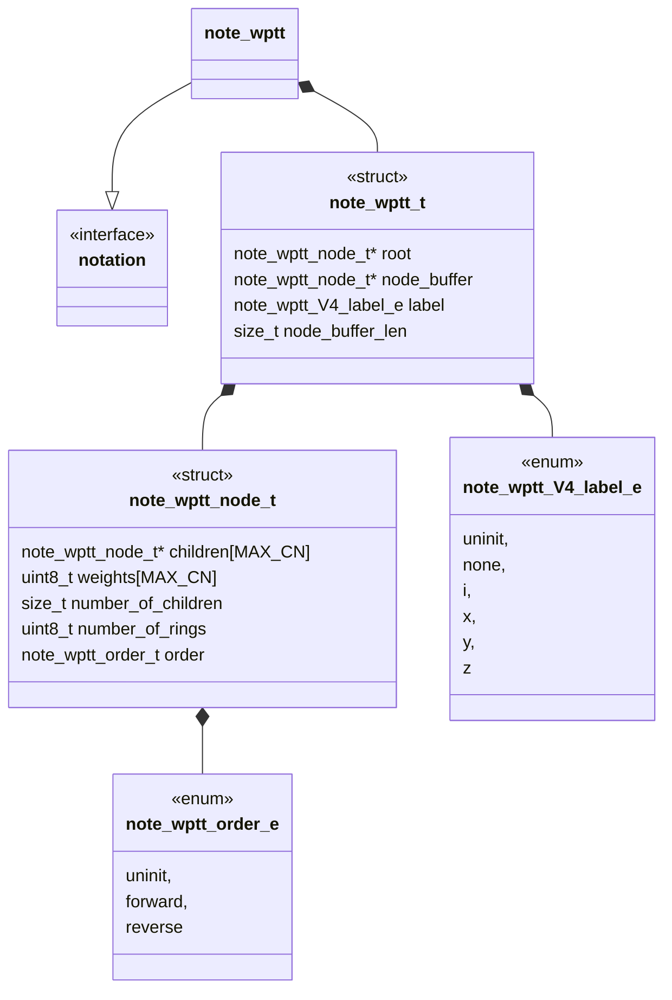
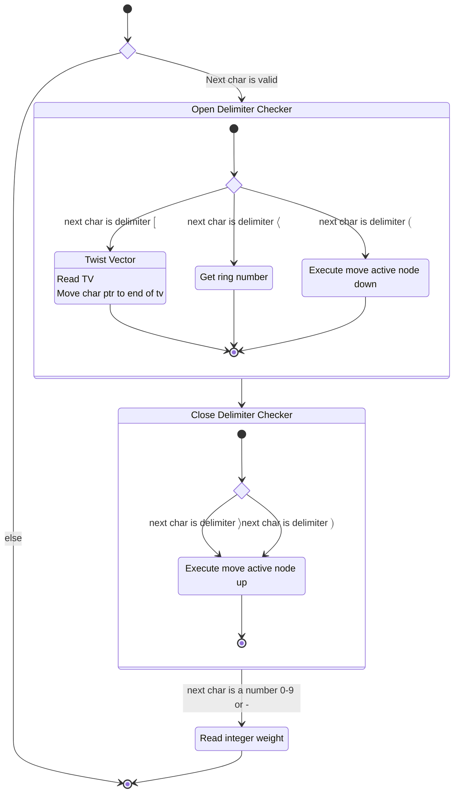
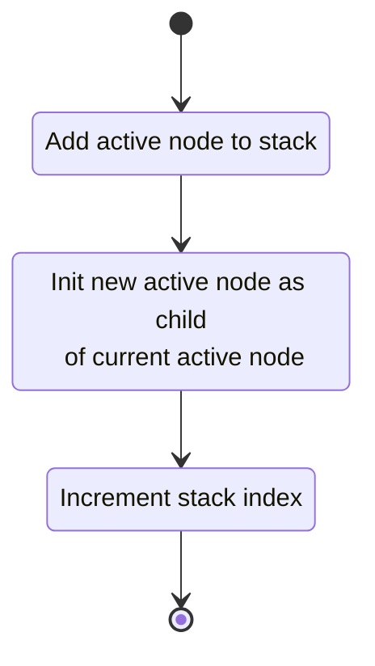
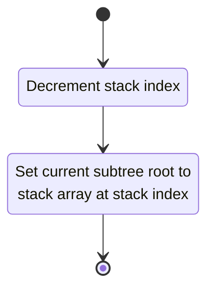
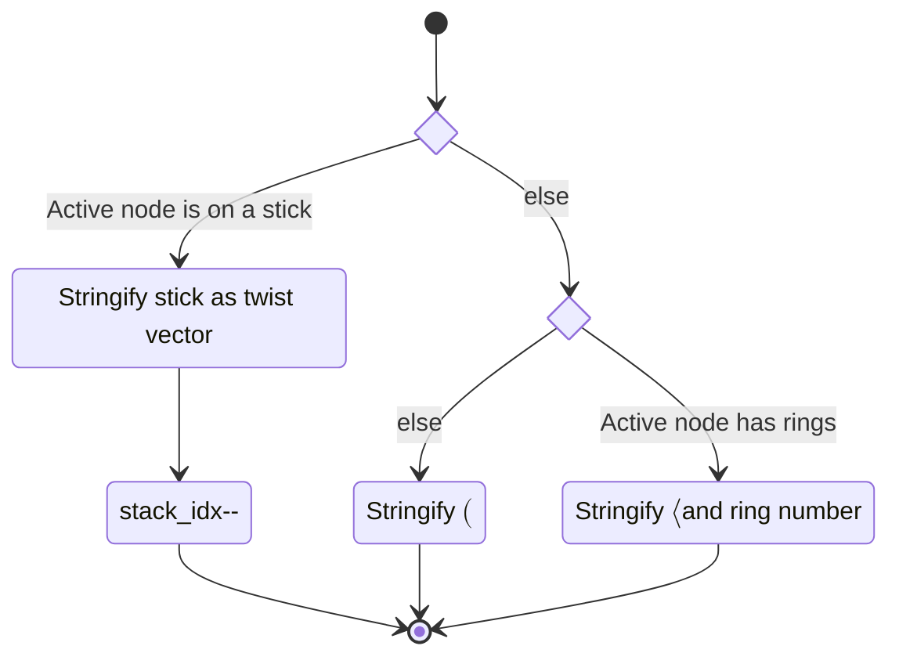

# Unit Description

## Language

C

## Implements

- [Notations Interface][interface-notation]

## Uses

The wptt notation component does not use any other components.

## External Libraries

The wptt notation component does not use any external libraries.

## Functionality

### Public

#### Structures

##### Notation Structure

The interface structure for the component is designed to match the non memory allocating design
goals of non-runner components. That means this notation structure contains:

- A pointer to the root of the wptt
- A buffer of/for nodes in the wptt
- A length for the buffer supplied to the component instance
- A $V_4$ label for the wptt

##### Node Structure

We saw in the use-case description an outline for the important data that needs to be encoded in a
wptt data structure. This data is summarized as:

- Children and their cyclic order
- Weights and their location in the cyclic order
- Number of rings

Each of these items is easy to encode in a C structure. The children (except parent linkage) are
encoded as an array of pointers to the children. Additionally, this array implicitly encodes a
cyclic order of the children by the order in the array. Weights are encoded likewise in an array.
Weight index is interpreted as "after" the same child weight in order as seen below.

<!-- prettier-ignore-start -->

!!! example "Example: Interleaved index"

    For child array $[c_0,c_1,\cdots,c_{n-1}]$ and weight array
    $[w_0,w_1,\cdots,w_{n-1}]$. The order as described in the
    [use-case](#linearize_a_vertex) is given as:

    - Forward $$w_0c_0w_1c_1\cdots w_{n-1}c_{n-1}w_{n}$$ Forward it the assumed
        default.
    - Reverse $$w_{n}c_{n-1}w_{n-1}\cdots,w_1c_1w_0, $$

<!-- prettier-ignore-end -->

Finally, read order is encoded as a simple enum consisting of:

- uninit
- forward
- reverse

This allows components to invert read order, read from $(n-1)\to 0$, at runtime.

#### Functions

##### Decode Function

The decode function takes in the linearized string form of the wptt and decodes it as a
`note_wptt_node_t`.

This process is described in the following state machines:

```mermaid
stateDiagram-v2
    state "Init" as vj
    state "🔵 stack array" as vj
    state "🔵 stack index" as vj
    state "🔵 char pointer" as vj
    state "read label from $$\,V_4$$" as rl
    state "Handle Root Init" as ri
    state if_end_of_string <<choice>>
    state "Execute char checker" as rn
    state "Move char pointer to</br> next char in string" as nc
    [*] --> vj
    vj --> rl
    rl --> ri
    ri --> if_end_of_string
    if_end_of_string --> nc: is not end of string
    nc --> rn
    rn --> if_end_of_string
    if_end_of_string --> [*]: is end of sting

```

##### Encode Function

The encode function takes in a `note_wptt_node_t` and encodes it into the linearized string form of
the wptt.

```mermaid
stateDiagram-v2
    state "Init" as vj
    state "🔵 stack parent array" as vj
    state "🔵 stack child_idx array" as vj
    state "🔵 stack_idx as 0" as vj
    state "🔵 active node as root" as vj
    state "Push to stack" as prts
    state "🔴 root" as prts
    state "🔴 0 to child_idk" as prts
    state "Stringify $$\,V_4$$ label" as sl
    state "Execute handle stack" as handle_stack
    state "Execute handle stringify" as handle_stringify
    state "stack_idx--" as simm2
    state "Stringify weight at</br>child_idx of active node" as sw
    state if_root_labeled_done <<choice>>
    state if_children_exhausted <<choice>>
    state if_stack_idx_exhausted <<choice>>

    [*] --> vj
    if_children_exhausted --> handle_stack: else
    if_stack_idx_exhausted --> [*]: if stack_idx < 0
    vj --> if_root_labeled_done
    handle_stack --> handle_stringify
    if_root_labeled_done --> prts: Tree does not have a label
    if_root_labeled_done --> sl: Tree has a label
    sl --> prts
    prts --> sw
    sw --> if_children_exhausted
    if_children_exhausted --> if_stack_idx_exhausted: if child_idx > active node number_of_children
    if_stack_idx_exhausted --> simm2: else
    simm2 --> sw
    handle_stringify --> sw
```

### Private

#### Structures

The component has no private structures.

#### Functions

##### Decode Path

###### Char Checker

This function checks a character passed to it and updates the current notation instance with one of
seven execution paths. These paths are based on the class the character falls into:

- A delimiter
    - An opening delimiter
        - $\langle$
        - $[$
        - $($
    - A closing delimiter
        - $\rangle$
        - $)$
- An integer beginning with "0-9" or "-"
- A space character

###### Move Active Node Down

This function moves the active node to be a child of the current node. Functionally, this is the
same as descending the wptt.

###### Move Root Up

This function moves the active node to be a parent of the current node. Functionally, this is the
same as ascending the wptt.

##### Encode Path

###### Handle Stack

```mermaid
stateDiagram-v2

    state "Push to stack" as pants
    state "🔴 child node at child_idk node" as pants
    state "🔴 0 to child_idx" as pants
    state "stack_idx++" as sipp
    state "child_idx[stack_idx]++" as cipp
    [*] --> pants
    pants --> cipp
    cipp --> sipp
    sipp --> [*]
```

###### Handle Stringify

## Validation

### Decode Interface

#### Positive Tests

<!-- prettier-ignore-start -->

!!! test-card "Valid string representing a knot"

    A valid string representing a knot (no free bond) is fed to the function.

    **Inputs:**

    - A valid string representing a knot.
    - A stick tree.
    - A tree with an essential vertex.
    - A tree with a vertex that has ring number.
    - A tree with a vertex with more than one weight.

    **Expected Output:**

    A valid decoding of the string

<!-- prettier-ignore-end -->

<!-- prettier-ignore-start -->

!!! test-card "Valid string representing a tangle"

    A valid string representing a tangle (with free bond) is fed to the function.

    **Inputs:**

    - A valid string representing a tangle with each label:
        - i
        - x
        - y
        - z
    - A stick tree.
    - A tree with an essential vertex.
    - A tree with a vertex that has ring number.
    - A tree with a vertex with more than one weight.

    **Expected Output:**

    A valid decoding of the string

<!-- prettier-ignore-end -->

#### Negative Tests

<!-- prettier-ignore-start -->

!!! test-card "A malformed tree is fed to the function"

    Various malformed trees are fed to the function.

    **Inputs:**

    Malformed strings with the following characteristics:

    - A missing closing delimiter.
    - An unexpected character is in the string.
    - The string has more weights than possible.
    - An empty string.

    **Expected Output:**

    The function reports an error.

<!-- prettier-ignore-end -->

### Encode Interface

#### Positive Tests

<!-- prettier-ignore-start -->

!!! test-card "A valid knot wptt is fed to the function"

    A valid knot wptt (with no label) is fed to the encode function.

    **Inputs:**

    - A valid wptt representing a knot.
    - A stick wptt.
    - A wptt with an essential vertex.
    - A wptt with a vertex that has ring number.
    - A wptt with a vertex with more than one weight.

    **Expected Output:**

    The function produces the corresponding encoded string.

<!-- prettier-ignore-end -->

<!-- prettier-ignore-start -->

!!! test-card "A valid tangle wptt is fed to the function"

    A valid tangle wptt (with label) is fed to the encode function.

    **Inputs:**

    - A valid wptt representing a tangle with each label:
        - i
        - x
        - y
        - z
    - A stick wptt.
    - A wptt with an essential vertex.
    - A wptt with a vertex that has ring number.
    - A wptt with a vertex with more than one weight.
    - A wptt with a vertex that has reverse order.

    **Expected Output:**

    The function produces the corresponding encoded string.

<!-- prettier-ignore-end -->

#### Negative Tests

<!-- prettier-ignore-start -->

!!! test-card "A malformed wptt is passed to the function"

    A malformed wptt is passed to the function.

    **Inputs:**

    - A NULL child is present
    - A NULL root is present
    - An UNINIT label is present

    **Expected Output:**

    The function will produce an error.

<!-- prettier-ignore-end -->

<!-- prettier-ignore-start -->

!!! test-card "A NULL string buffer is passed"

    The output string buffer is a NULL pointer.

    **Inputs:**

    - A NULL pointer buffer is passed to the function

    **Expected Output:**

    The function will produce an error.

<!-- prettier-ignore-end -->
