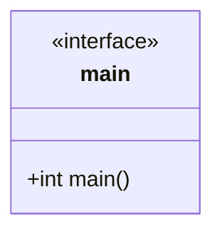

# @@@TODO Use Case: Command Line Interface Runner



## Language

C++

## Libraries

Uses [cxxopts](https://github.com/jarro2783/cxxopts) for command line arguments.

## Uses

- [JSON](../store-json/use-case)
- [Screen](../../docs/use_cases/storage/screen.md)
- [SQLite](../storage/sqlite.md)
- [Rational](../gen-rational/use-case)
- [Keyboard (read only)](<../storage/keyboard_(read_only).md>)

## Functionality

Main calling routine.

```{raw} latex
    \newpage
```
