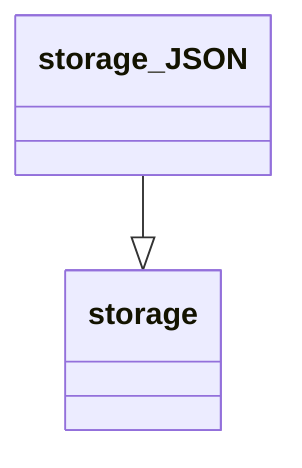

# Unit Description



## Language

C++

## Implements

[Interface](../../docs/unit_description/storage-interface.md)

## Libraries

## Functionality

## Doxygen Documentation

```{doxygenfile} storage_json.h

```

```{doxygenfile} storage_json.c

```

## Bibliography

```{bibliography}
   :filter: docname in docnames
```

```{raw} latex
    \newpage
```
