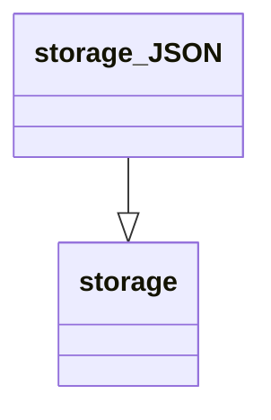

# @@@TODO Unit Description: JSON Storage



## Language

C++

## Implements

[Interface](../../docs/unit_description/storage-interface.md)

## Libraries

## Functionality

```{raw} latex
    \newpage
```
