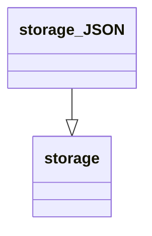

# @@@TODO Use Case: JSON Storage


```mermaid
classDiagram
    storage_JSON --|> storage
```

## Language

C++

## Implements

[Interface](../../docs/use_cases/storage-interface.md)

## Libraries

## Functionality

```{raw} latex
    \newpage
```
